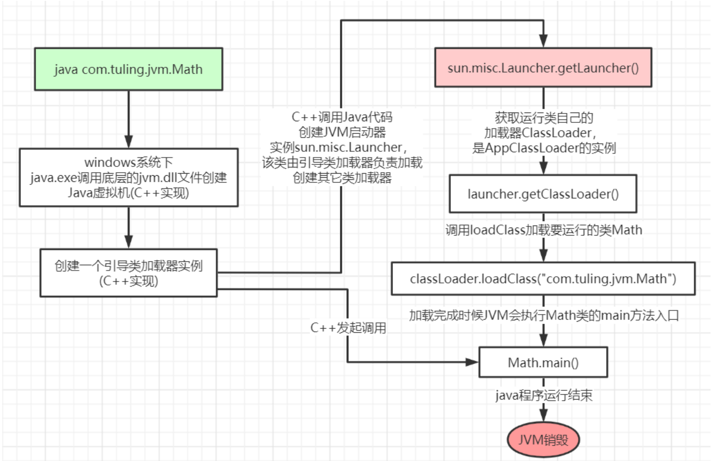
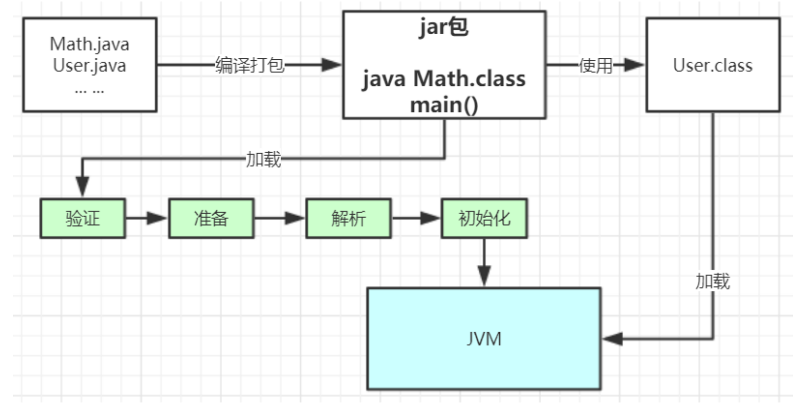
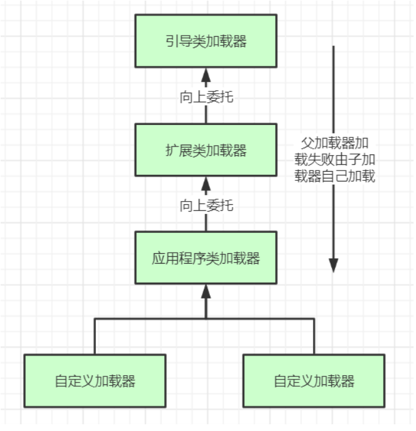

## 一、类的加载过程

当我们运行一个main方法时，发生了什么？

```java
package com.tuling.jvm;

public class Math {
    public static final int initData = 666;
    public static User user = new User();

    public int compute() { //一个方法对应一块栈帧内存区域 
        int a = 1;
        int b = 2;
        int c = (a + b) * 10;
        return c;
    }

    public static void main(String[] args) {
        Math math = new Math();
        math.compute();
    }
}
```

<!-- more -->

加载过程如图：



在`classLoader.loadClass("com.tuling.jvm.Math")`这一步，加载Math类的过程如下：

**加载 >> 验证 >> 准备 >> 解析 >> 初始化 >>** 使用 >> 卸载 

 * 加载：在硬盘上查找并通过IO读入字节码文件。注意：当使用到该类时才会加载，例如调用类的 main()方法，new对象等等，在加载阶段会在内存中生成一个**代表这个类的java.lang.Class对象**，作为方法区这个类的各种数据的访问入口（反射）

 * 验证：校验字节码文件的正确性 （例如16进制查看.class文件，以CA FE BA BE开头，咖啡宝贝）
 * 准备：给类的静态变量分配内存，并赋予默认值
 * 解析：将**符号引用**替换为直接引用，该阶段会把一些静态方法(符号引用，比如 main()方法)替换为指向数据所存内存的指针或句柄等(直接引用)，这是所谓的**静态链接**过 程(类加载期间完成)，**动态链接**是在程序运行期间完成的将符号引用替换为直接引用，动态链接 见下篇（Java虚拟机）
 * **初始化**：对类的静态变量初始化为指定的值，执行静态代码块



类被加载到方法区中后主要包含 **运行时常量池、类型信息、字段信息、方法信息、类加载器的引用、对应class实例的引用**等信息。 **类加载器的引用**：这个类到类加载器实例的引用 

**对应class实例的引用**：类加载器在加载类信息放到方法区中后，会创建一个对应的Class 类型的 对象实例放到堆(Heap)中, 作为开发人员访问方法区中类定义的入口和切入点。 

## 二、**类加载器** 

* 引导类加载器：负责加载支撑JVM运行的位于JRE的lib目录下的核心类库，比如rt.jar、charsets.jar等 

* 扩展类加载器：负责加载支撑JVM运行的位于JRE的lib目录下的ext扩展目录中的JAR类包

* 应用程序类加载器：负责加载ClassPath路径下的类包，主要就是加载我们自己写的那些类

* 自定义加载器：负责加载用户自定义路径下的类包 

  

  **上面三种类加载器**示例：

```java

public class TestJDKClassLoader {

    public static void main(String[] args) {
        System.out.println("引导类加载器"+ String.class.getClassLoader());
  System.out.println(com.sun.crypto.provider.DESKeyFactory.class.getClassLoader().getClass().getName());
 System.out.println(TestJDKClassLoader.class.getClassLoader().getClass().getName());

        System.out.println();

        ClassLoader appClassLoader = ClassLoader.getSystemClassLoader();
        ClassLoader extClassloader = appClassLoader.getParent();
        ClassLoader bootstrapLoader = extClassloader.getParent();
        System.out.println("the bootstrapLoader : " + bootstrapLoader);
        System.out.println("the extClassloader : " + extClassloader);
        System.out.println("the appClassLoader : " + appClassLoader);

        System.out.println();

        System.out.println("bootstrapLoader加载以下文件：");
        URL[] urls = Launcher.getBootstrapClassPath().getURLs();
        for (int i = 0; i < urls.length; i++) {
            System.out.println(urls[i]);
        }
        System.out.println();
        System.out.println("extClassloader加载以下文件：");
        System.out.println(System.getProperty("java.ext.dirs"));
        System.out.println();
        System.out.println("appClassLoader加载以下文件：");
        System.out.println(System.getProperty("java.class.path"));
    }
}
```

运行结果：

```
引导类加载器null
sun.misc.Launcher$ExtClassLoader
sun.misc.Launcher$AppClassLoader

the bootstrapLoader : null
the extClassloader : sun.misc.Launcher$ExtClassLoader@f49f1c
the appClassLoader : sun.misc.Launcher$AppClassLoader@b4aac2

bootstrapLoader加载以下文件：
file:/D:/java/jdk1.8.0_261/jre/lib/resources.jar
file:/D:/java/jdk1.8.0_261/jre/lib/rt.jar
file:/D:/java/jdk1.8.0_261/jre/lib/sunrsasign.jar
file:/D:/java/jdk1.8.0_261/jre/lib/jsse.jar
file:/D:/java/jdk1.8.0_261/jre/lib/jce.jar
file:/D:/java/jdk1.8.0_261/jre/lib/charsets.jar
file:/D:/java/jdk1.8.0_261/jre/lib/jfr.jar
file:/D:/java/jdk1.8.0_261/jre/classes

extClassloader加载以下文件：
D:\Java\jdk1.8.0_261\jre\lib\ext;C:\WINDOWS\Sun\Java\lib\ext

appClassLoader加载以下文件：
D:\java\jdk1.8.0_261\jre\lib\charsets.jar;D:\java\jdk1.8.0_261\jre\lib\deploy.jar;D:\java\jdk1.8.0_261\jre\lib\ext\access-bridge-32.jar;
```

**类加载器初始化过程**

sun.misc.Launcher初始化使用了单例模式设计，保证一个JVM虚拟机内只有一个 实例。 

在Launcher构造方法内部，其创建了两个类加载器，分别是 ExtClassLoader(扩展类加载器)和AppClassLoader(应用类加载器)。 

**两个类为Launcher的内部类**。JVM默认使用Launcher的getClassLoader()方法返回的类加载器AppClassLoader的实例加载我们 的应用程序。 

```java
//Launcher的构造方法
public Launcher() {
        Launcher.ExtClassLoader var1;
        try {
            //构造扩展类加载器，在构造的过程中将其父加载器设置为null
            var1 = Launcher.ExtClassLoader.getExtClassLoader();
        } catch (IOException var10) {
            throw new InternalError("Could not create extension class loader", var10);
        }

        try {
            //构造应用类加载器，在构造的过程中将其父加载器设置为ExtClassLoader
            this.loader = Launcher.AppClassLoader.getAppClassLoader(var1);
        } catch (IOException var9) {
            throw new InternalError("Could not create application class loader", var9);
        }
        Thread.currentThread().setContextClassLoader(this.loader);
        String var2 = System.getProperty("java.security.manager");
        //。。。省略代码
}
```

## 三、双亲委派机制



**双亲委派机制说简单点就是，先找父亲加载，不行再由儿子自己加载**

下面是应用程序类加载器AppClassLoader加载类的双亲委派机制源码，AppClassLoader 的loadClass方法最终会调用其顶级父类——ClassLoader的loadClass()方法，该方法的大体逻辑如下： 

1. 首先，检查一下指定名称的类是否已经加载过，如果加载过了，就不需要再加载，直接 返回。 

2. 如果此类没有加载过，那么，再判断一下是否有父加载器；如果有父加载器，则由父加 载器加载（即调用parent.loadClass(name, false);）.或者是调bootstrap类加载器来加载。

3. 如果父加载器及bootstrap类加载器都没有找到指定的类，那么调用当前类加载器的findClass()方法来完成类加载。 

```java
protected Class<?> loadClass(String name, boolean resolve)
        throws ClassNotFoundException
    {
        synchronized (getClassLoadingLock(name)) {
            // 首先检查该类是否已经加载过了。
            Class<?> c = findLoadedClass(name);
            if (c == null) { //没有加载过该类
                long t0 = System.nanoTime();
                try {
                    if (parent != null) {
                        c = parent.loadClass(name, false); //向上委派ExtClassLoader
                    } else {
                        c = findBootstrapClassOrNull(name); //向上委派BootStrapLoader
                    }
                } catch (ClassNotFoundException e) {
                    // ClassNotFoundException thrown if class not found
                    // from the non-null parent class loader
                }

                if (c == null) {
                    // 双亲委派过后，还没有找到，那么自己加载。
                    long t1 = System.nanoTime();
                    c = findClass(name);

                    // this is the defining class loader; record the stats
                    sun.misc.PerfCounter.getParentDelegationTime().addTime(t1 - t0);
                    sun.misc.PerfCounter.getFindClassTime().addElapsedTimeFrom(t1);
                    sun.misc.PerfCounter.getFindClasses().increment();
                }
            }
            if (resolve) {
                resolveClass(c);
            }
            return c;
        }
    }
```

**为什么要设计双亲委派机制？** 

* 沙箱安全机制：自己写的java.lang.String.class类不会被加载，这样便可以防止核心API库被随意篡改 

* 避免类的重复加载：当父亲已经加载了该类时，就没有必要子ClassLoader再加载一次，保证——**被加载类的唯一性**

沙箱安全机制演示示例：

```java
package java.lang;

public class String {

    public static void main(String[] args) {
        System.out.println("my String class");
    }
}
```

 运行结果：

```
错误: 在类 java.lang.String 中找不到 main 方法, 请将 main 方法定义为: 
public static void main(String[] args) 
否则 JavaFX 应用程序类必须扩展javafx.application.Application
```

**全盘负责委托机制** 

“**全盘负责**”是指当一个ClassLoder装载一个类时，除非显示的使用另外一个ClassLoder，该类所依赖及引用的类也由这个ClassLoder载入。

## 四、自定义类加载器示例

自定义类加载器只需要继承 java.lang.ClassLoader 类，该类有两个核心方法，

* loadClass(String, boolean)，实现了**双亲委派机制**

* findClass，默认实现是空方法

  所以我们自定义类加载器主要是**重写findClass方法**。

```java
public class MyClassLoaderTest {

    //自定义类加载器
    static class MyClassLoader extends ClassLoader {

        private String path; //加载类的类路径

        public MyClassLoader(String path) {
            this.path = path;
        }

        @Override
        protected Class<?> findClass(String name) throws ClassNotFoundException {
            byte[] data = new byte[0];
            try {
                data = loadByte(name); //获取目标类的字节码数据
            } catch (Exception e) {
                e.printStackTrace();
            }
            return defineClass(name, data, 0, data.length); //加载类
        }

        /**
         * 读取本地类字节码 -工具方法
         *
         * @param name
         * @return
         * @throws Exception
         */
        private byte[] loadByte(String name) throws Exception {
            name = name.replaceAll("\\.", "/");
            FileInputStream fis = new FileInputStream(path + "/" + name + ".class");
            int len = fis.available();
            byte[] bytes = new byte[len];
            fis.read(bytes);
            fis.close();
            return bytes;
        }

        public static void main(String[] args) throws Exception {
            MyClassLoader myClassLoader = new MyClassLoader("D:/test");
            Class<?> clazz = myClassLoader.loadClass("JVMDemo.Book1");
            Object obj = clazz.newInstance();
            Method method = clazz.getDeclaredMethod("test", null);
            method.invoke(obj, null);
            System.out.println(clazz.getClassLoader().getClass().getName());
            //期望：demointerface.MyClassLoaderTest$MyClassLoader
        }
    }
 }
```

**打破双亲委派机制** 

再来一个沙箱安全机制示例，尝试打破双亲委派机制，用自定义类加载器加载我们自己实现的JVMDemo.Book1.class

```java
package JVMDemo;

public class Book1 {

    private int id;
    private String name;

    public void test(){
        System.out.println("获取到了Book1");
    }
}
```


```java
public class MyClassLoaderTest {

    //打破双亲委派机制的自定义类加载器
    static class MyClassLoader2 extends ClassLoader {

        private String path;

        public MyClassLoader2(String path) {
            this.path = path;
        }

        /**
         *  直接重写类加载方法，实现自己的加载逻辑，不委派给双亲加载
         * @param name
         * @param resolve
         * @return
         * @throws ClassNotFoundException
         */
        @Override
        protected Class<?> loadClass(String name, boolean resolve) throws ClassNotFoundException {
            synchronized (getClassLoadingLock(name)) {
                // First, check if the class has already been loaded
                Class<?> c = findLoadedClass(name);
                if (c == null) {
                    long t0 = System.nanoTime();
                    long t1 = System.nanoTime();
                    if (!name.startsWith("JVMDemo")) { //其他的类还是走双亲委派机制
                        c = this.getParent().loadClass(name);
                    } else { //自己写的类走我们写的方法
                        c = findClass(name);
                    }

                    sun.misc.PerfCounter.getParentDelegationTime().addTime(t1 - t0);
                    sun.misc.PerfCounter.getFindClassTime().addElapsedTimeFrom(t1);
                    sun.misc.PerfCounter.getFindClasses().increment();
                }

                if (resolve) {
                    resolveClass(c);
                }
                return c;
            }
        }

        @Override
        protected Class<?> findClass(String name) throws ClassNotFoundException {
            byte[] data = new byte[0];
            try {
                data = loadByte(name);
            } catch (Exception e) {
                e.printStackTrace();
            }
            return defineClass(name, data, 0, data.length);
        }

        /**
         * 读取本地类字节码 -工具方法
         *
         * @param name
         * @return
         * @throws Exception
         */
        private byte[] loadByte(String name) throws Exception {
            name = name.replaceAll("\\.", "/");
            FileInputStream fis = new FileInputStream(path + "/" + name + ".class");
            int len = fis.available();
            byte[] bytes = new byte[len];
            fis.read(bytes);
            fis.close();
            return bytes;
        }

        public static void main(String[] args) throws ClassNotFoundException, IllegalAccessException, InstantiationException, NoSuchMethodException, InvocationTargetException {
            MyClassLoader2 myClassLoader = new MyClassLoader2("D:/test");
            Class<?> clazz = myClassLoader.loadClass("JVMDemo.Book1");
            Object obj = clazz.newInstance();
            Method method = clazz.getDeclaredMethod("test", null);
            method.invoke(obj, null);
            System.out.println(clazz.getClassLoader().getClass().getName());
            //期望：JVMDemo.MyClassLoaderTest$MyClassLoader2
        }
    }
}
```

