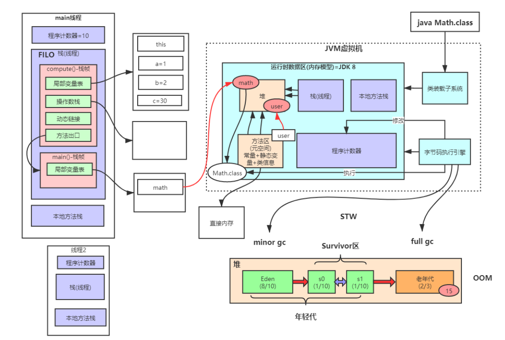
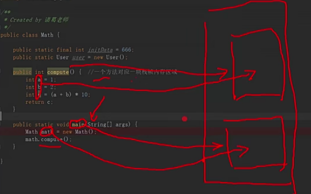

## 一、**JVM整体结构及内存模型**

<!-- more -->

图中橙色区域为所有线程共享，紫色区域为线程私有。

### 1、堆

* 内存分配：年轻代1/3，老年代2/3.
* **minor gc过程**：当Eden区快满时，触发minor gc（垃圾回收），根据可达性分析算法，对方法区和栈区的gc roots进行溯源，查找堆区中的对象，直至最后一个引用，能找到的整个复制到s0区域，然后直接清空Eden区，同时该对象年龄+1，等到下一次minor gc时，会对Eden区和s0区进行垃圾回收，完成后，将有用的全部复制到s1区，整个清空Eden和s0，有用的对象就在s0和s1区来回复制，当对象年龄==15，则会放到老年代，如果老年代内存快满了，会执行full gc，若还不能留出空间，直接OOM（out of memory内存溢出）程序挂掉。

### 2、栈（线程栈）

* 每一个线程都会在栈中分配一块栈内存，当该线程运行时，每运行一个方法，就会在当前线程的栈内存中再细分分配一个栈帧内存区域（一个方法对应一块栈帧），first in last out 先入栈的方法，最后出栈。

   

* 栈帧的组成： 
  	1. 局部变量表
   	2. 操作数栈：int b = 2;  对应到底层逻辑：局部变量表中存入b，jvm将2放入操作数栈，然后赋值给b。
   	3. 动态链接：例如：User user = new User(); user是一个局部变量，程序运行时存放在栈中，而new的User对象存放在堆中，所以动态链接实质上是一个指针，指向堆中的User对象。
   	4. 方法出口：举例：运行main方法时，遇到一个别的方法，则记录下当前运行位置，再去执行这个内部方法，内部方法完成后，再通过记录的方法出口，继续运行main方法。

### 3、本地方法栈

​	当java程序运行到了本地方法（native修饰的java语言内部的方法），就放到本地方法栈中分配一块内存空间去运行。

### 4、方法区（元空间）

	* 存放常量+静态变量+类型信息
 * 和堆同样相关联：比如：类成员变量 ==>  public static User user = new User()；
   user存放在方法区，但new的User对象存放在堆中，所以方法区存放了指针，指向堆。

### 5、程序计数器

​	用途：当当前线程被挂起，然后又再次运行时，需要知道从哪个位置开始运行。