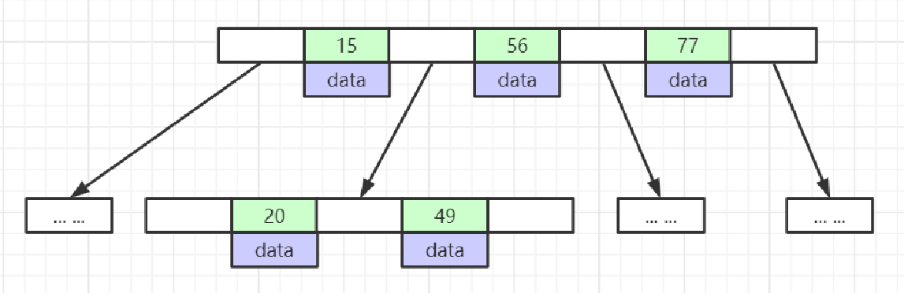
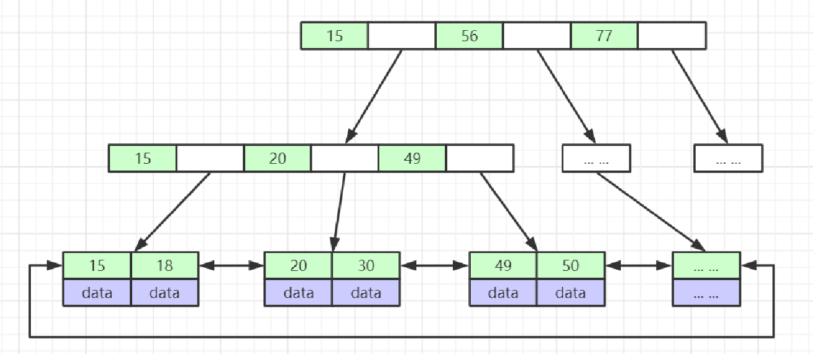
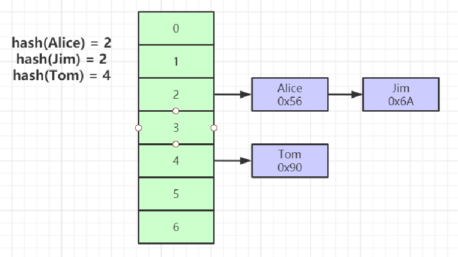
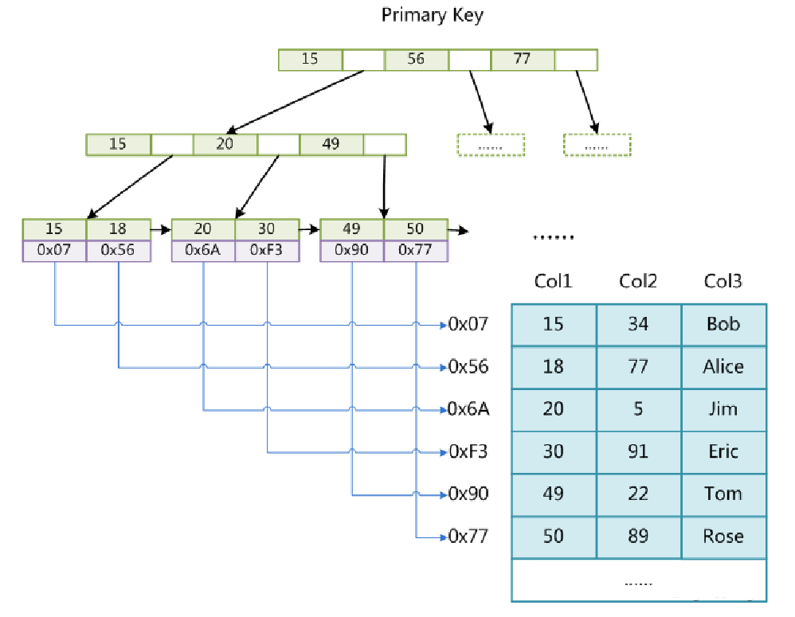
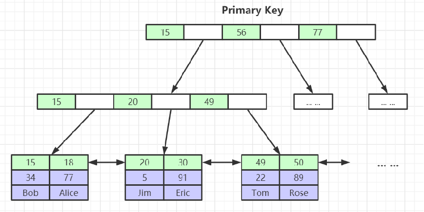
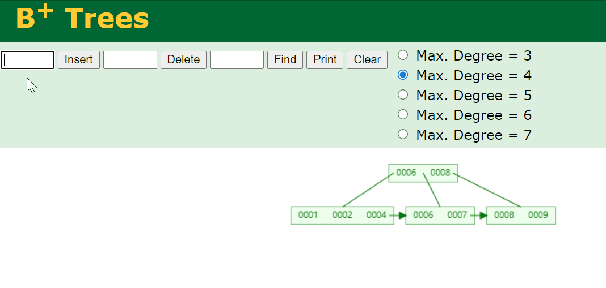
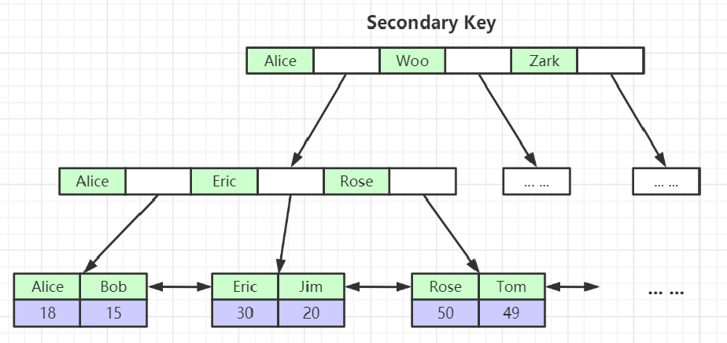
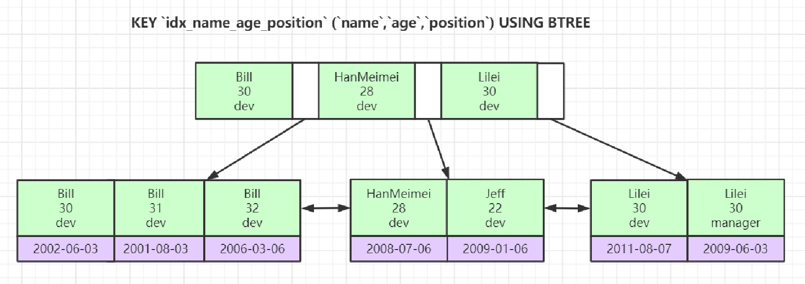

## 一、深入理解Mysql索引底层数据结构与算法

1. 索引是帮助MySQL高效获取数据的**排好序的数据结构**

2. 索引数据结构：
   * 二叉树
   * 红黑树
   * Hash表
   * B-Tree

   <!-- more -->
   
3. Mysql有几种索引？

> 从数据结构角度：
>
> 1. B+树结构
> 2. hash索引
> 3. FULLTEXT索引
> 4. R-tree索引
>
> 从物理存储角度：
>
> 1. 聚集索引
> 2. 非聚集索引
>
> 从逻辑角度：
>
> 1. 主键索引：主键索引是一种特殊的唯一索引，不允许有空值
> 2. 普通索引或者单列索引
> 3. 复合索引（复合索引）
> 4. 唯一索引或非唯一索引
> 5. 空间索引

#### B-Tree

* 叶节点具有相同的深度，叶节点的指针为空
* 所有索引元素不重复
* 节点中的数据索引从左到右递增排列

#### B+Tree(B-Tree变种)

* 非叶子节点不存储data，只存储索引(冗余)，可以放更多的索引
* 叶子节点包含所有索引字段
* 叶子节点用指针连接，提高区间访问的性能
* 叶子节点从小到大顺序排列

### Hash

* 对索引的的key进行一次hash计算就可以定位出数据存储的位置
* 很多时候Hash索引要比B+树更加高效
* 缺点：只能满足“=”，“IN”，**不支持范围查找**
* 存在Hash冲突的问题

### MyISAM

MyISAM索引文件和数据文件是分离的(非聚集索引：索引和数据不存在一起)

### InnoDB索引实现(聚集索引)

* 表数据文件本身就是按B+树组织的一个索引结构文件
* 为聚集索引（叶子节点包含了完整的数据记录）
* 为什么建议InnoDB表必须建主键，并且推荐使用整形的自增主键？

> 1、因为InnoDB表需要用B+树结构来组织整张表，假如我们不建立主键，那么Mysql会自己从表中选择一个合适的列作为主键来组织整张表，如果没有合适的列，那么就会建立一个隐藏列，来作为主键组织表结构。
> 2、整形：因为索引是按照大小来进行组织排列的，所以在写入和查询的时候，都要进行频繁的比较大小，而使用整形，无疑是最快的！并且，整形相比字符串等类型，占用空间也是比较小的，节省了内存空间。
> 3、自增主键：B+树是从左到右依次递增的，如果不是自增主键，假如插入一个比之前的数小的主键，那么就要对前排的节点进行重构和整个树的平衡，降低插入效率。如下图：
>
> 

* 为什么非主键索引结构叶子节点存储的是主键值？（下图Secondary Key）

> 节省了存储空间，并且只需要在主键索引插入完成后，非主键索引只需要多插入一条主键数据就完成了索引的维护，容易保持一致性，降低插入的复杂度。

### 联合索引的底层存储结构

索引最左前缀原理：先比较name，再比较age，最后比较position列，依次排序。所以我们在使用联合索引的时候，不能跳过最左边的列，举例：

~~~ 
select * from employee where name = 'Bill' and age =31; 正确示范
select * from employee where age =31 and  position = 'dev' ; 错误示范
select * from employee where position = 'dev' ;  错误示范
~~~

为什么要遵循索引最左前缀来使用查询？

> 因为跳过第一个字段，直接查询后面的字段，这在索引中是无序的，没有顺序，就会进行全表扫描，所以要使用第一个字段才能走联合索引。

## 二、Explain详解与索引最佳实践

