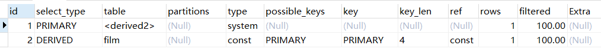

## 一、深入理解Mysql索引底层数据结构与算法

1. 索引是帮助MySQL高效获取数据的**排好序的数据结构**

2. 索引数据结构：
   * 二叉树
   * 红黑树
   * Hash表
   * B-Tree

   <!-- more -->
   
3. Mysql有几种索引？

> 从数据结构角度：
>
> 1. B+树结构
> 2. hash索引
> 3. FULLTEXT索引
> 4. R-tree索引
>
> 从物理存储角度：
>
> 1. 聚集索引
> 2. 非聚集索引
>
> 从逻辑角度：
>
> 1. 主键索引：主键索引是一种特殊的唯一索引，不允许有空值
> 2. 普通索引或者单列索引
> 3. 复合索引（复合索引）
> 4. 唯一索引或非唯一索引
> 5. 空间索引

#### B-Tree

* 叶节点具有相同的深度，叶节点的指针为空
* 所有索引元素不重复
* 节点中的数据索引从左到右递增排列

#### B+Tree(B-Tree变种)

* 非叶子节点不存储data，只存储索引(冗余)，可以放更多的索引
* 叶子节点包含所有索引字段
* 叶子节点用指针连接，提高区间访问的性能
* 叶子节点从小到大顺序排列

### Hash

* 对索引的的key进行一次hash计算就可以定位出数据存储的位置
* 很多时候Hash索引要比B+树更加高效
* 缺点：只能满足“=”，“IN”，**不支持范围查找**
* 存在Hash冲突的问题

### MyISAM

MyISAM索引文件和数据文件是分离的(非聚集索引：索引和数据不存在一起)

### InnoDB索引实现(聚集索引)

* 表数据文件本身就是按B+树组织的一个索引结构文件
* 为聚集索引（叶子节点包含了完整的数据记录）
* 为什么建议InnoDB表必须建主键，并且推荐使用整形的自增主键？

> 1、因为InnoDB表需要用B+树结构来组织整张表，假如我们不建立主键，那么Mysql会自己从表中选择一个合适的列作为主键来组织整张表，如果没有合适的列，那么就会建立一个隐藏列，来作为主键组织表结构。
> 2、整形：因为索引是按照大小来进行组织排列的，所以在写入和查询的时候，都要进行频繁的比较大小，而使用整形，无疑是最快的！并且，整形相比字符串等类型，占用空间也是比较小的，节省了内存空间。
> 3、自增主键：B+树是从左到右依次递增的，如果不是自增主键，假如插入一个比之前的数小的主键，那么就要对前排的节点进行重构和整个树的平衡，降低插入效率。如下图：
>
> 

* 为什么非主键索引结构叶子节点存储的是主键值？（下图Secondary Key）

> 节省了存储空间，并且只需要在主键索引插入完成后，非主键索引只需要多插入一条主键数据就完成了索引的维护，容易保持一致性，降低插入的复杂度。

### 联合索引的底层存储结构

索引最左前缀原理：先比较name，再比较age，最后比较position列，依次排序。所以我们在使用联合索引的时候，不能跳过最左边的列，举例：

~~~ 
select * from employee where name = 'Bill' and age =31; 正确示范
select * from employee where age =31 and  position = 'dev' ; 错误示范
select * from employee where position = 'dev' ;  错误示范
~~~

为什么要遵循索引最左前缀来使用查询？

> 因为跳过第一个字段，直接查询后面的字段，这在索引中是无序的，没有顺序，就会进行全表扫描，所以要使用第一个字段才能走联合索引。

## 二、Explain详解与索引最佳实践

### Explain分析实例

参考官方文档：https://dev.mysql.com/doc/refman/5.7/en/explain-output.html

~~~mysql
示例表：
drop table if EXISTS `actor`;
create table `actor` (
	`id` int(11) not null,
	`name` varchar(45) default null,
	`update_time` datetime default null,
	primary key (`id`)
) ENGINE=InnoDB default charset=utf8;

drop table if exists `film`;
CREATE TABLE `film`  (
  `id` int(11) NOT NULL AUTO_INCREMENT,
  `name` varchar(10) DEFAULT NULL,
  PRIMARY KEY (`id`),
	KEY `idx_name` (`name`)
)ENGINE=InnoDB default charset=utf8;

drop table if exists `film_actor`;
CREATE TABLE `film_actor`  (
  `id` int(11) NOT NULL,
  `film_id` int(11) NOT NULL,
  `actor_id` int(11) NOT NULL,
  `remark` varchar(255) DEFAULT NULL,
  PRIMARY KEY (`id`),
	key `idx_film_actor_id` (`film_id`,`actor_id`)
)ENGINE=InnoDB default charset=utf8;

INSERT INTO `actor` (`id`, `name`, `update_time`) VALUES (1,'a','2017‐12‐22 15:27:18'), (2,'b','2017‐12‐22 15:27:18'), (3,'c','2017‐12‐22 15:27:18');
INSERT INTO `film` (`id`, `name`) VALUES (3,'film0'),(1,'film1'),(2,'film2');
INSERT INTO `film_actor` (`id`, `film_id`, `actor_id`) VALUES (1,1,1),(2,1,2),(3,2,1);
~~~

explain示例：

~~~mysql
explain select * from actor;
~~~

### explain 两个变种

1. **explain extended**：会在explain的基础上额外提供一些查询优化的信息。额外还有filtered列，是一个半分比的值，rows*filtered/100可以估算出将要和explain中前一个表进行连接的行数（前一个表指 explain 中的id值比当前表id值小的表）。紧随explain语句其后通过 `show warnings` 命令可以得到优化后的查询语句，从而看出优化器优化了什么。

   ~~~mysql
   explain extended select * from film where id = 1;
   ~~~

   

   ~~~mysql
   show warnings;
   ~~~

   

2. **explain partitions**：相比 explain 多了个 partitions 字段，如果查询是基于分区表的话，会显示查询将访问的分区。

### explain中的列

接下来展示explain中每个列的信息

1. **id列**

   id列的编号是select的序列号，有几个select就有几个id，并且id的顺序是按照select出现的顺序增长的。id列值越大优先级越高，id相同则从上到下执行，id为null的最后执行。

2. **select_type列**

   select_type表示对应行是简单还是复杂查询。

   * simple：简单查询。该语句不包含子查询和union

     ~~~mysql
     explain select * from film where id = 2;
     ~~~

     

   * primary：复杂查询语句中最外层的select
   * subquery：包含在select中的子查询（不在from子句中）
   * derived：包含在from子句中的子查询。Mysql会将结果存放在一张临时表中，也叫派生表

   一个例子：了解primary、subquery和derived类型

   ~~~mysql
   set session optimizer_switch='derived_merge=off'; #关闭mysql5.7新特性对衍生表的合并优化 
   explain select (select 1 from actor where id = 1) from (select * from film where id = 1) der;
   ~~~

   

   * union：在union中的第二个和随后的select

     ~~~mysql
     explain select 1 union all select 1;
     ~~~

     

3. **table列**

   这一列表示explain的这一行正在访问哪张表。

   当 from 子句中有子查询时，table列是 <derivenN> 格式，表示当前查询依赖 id=N 的查询，于是先执行 id=N 的查询。

   当有 union 时，UNION RESULT 的 table 列的值为<union1,2>，1和2表示参与 union 的 select 行id。 

4. **type列**

   这一列表示**关联类型或访问类型**，即Mysql决定如何查询表中的行，查找数据行记录的大概范围。

   从最优到最差依次为：**system > const > eq_ref > ref > range >index > all**

   一般来说，**要保证查询达到range级别，最好达到ref**

   * **Null**：mysql能够在优化阶段分解查询语句，在执行阶段用不着再访问表或索引。例如：在索引中选取最小值，可以单独查找索引来完成，不需要在执行时访问表

     ~~~mysql
     explain select min(id) from film;
     ~~~

     

   * **const，system**：mysql能对查询的某些部分进行优化并将其转化成一个常量（可以看show warnings的结果）。用于primary key 或 unique key的所有列与常数比较时，所有表最多有一个匹配行，读取1次，速度比较快。**system是const的特例**，表里只有一条数据匹配时为system

     ~~~mysql
     explain extended select * from (select * from film where id = 1) tmp;
     ~~~

     

     ~~~mysql
     show warnings;
     ~~~

     

   * **eq_ref**：primary key或 unique key索引的所有部分被连接使用，最多会返回一条符合条件的记录。这可能是在const之外最好发连接类型了，简单的select查询不会出现这种type。

     ~~~mysql
     explain select * from film_actor left join film on film_actor.film_id = film.id;
     ~~~

     

   * **ref**：相比eq_ref，不使用唯一索引

