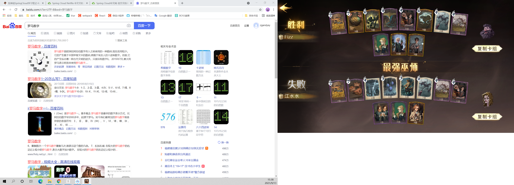
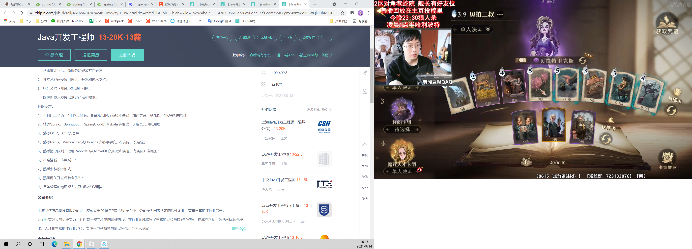

springcloud

微服务架构4个核心问题：

1. 服务很多，客户端该怎么访问？
2. 这么多服务，服务之间如何通信？
3. 这么多服务，如何治理？（发现与注册）
4. 服务挂了怎么办？

解决方案：
       Spring Cloud 生态！  SpringBoot

1. Spring Cloud NetFlix 一站式解决方案！

   api网关：zuul组件

   Feign --- HttpClient ----Http通信方式，同步阻塞

   服务注册发现： Eureka

   熔断机制： Hystrix

2. Apache Dubbo Zokeeper 半自动，需要整合别人的

   API：没有，找第三方组件或自己实现

   Dubbo：

   Zookeeper

   没有：借助Hystrix

3. Spring Cloud Alibaba 一站式解决方案！更简单

新概念：服务网格~ Server Mesh

万变不离其宗:

	1. API
 	2. HTTP,RPC
 	3. 注册与发现
 	4. 熔断机制

