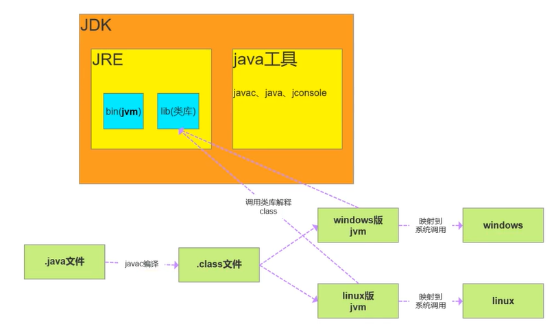
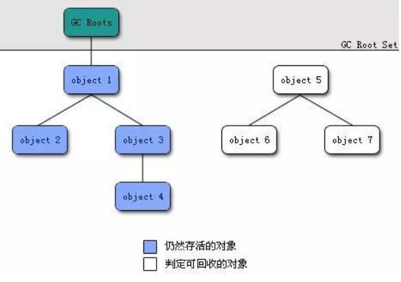
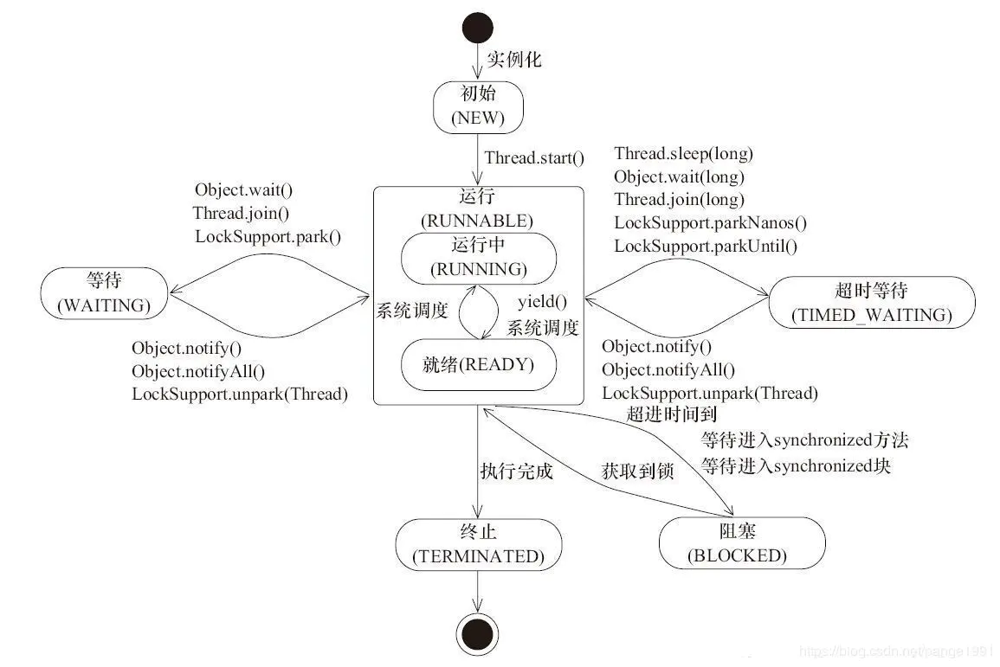
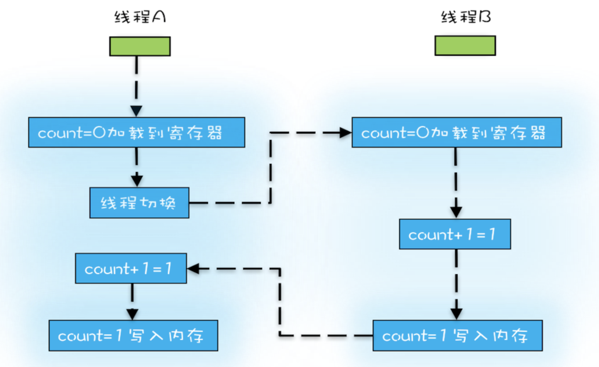
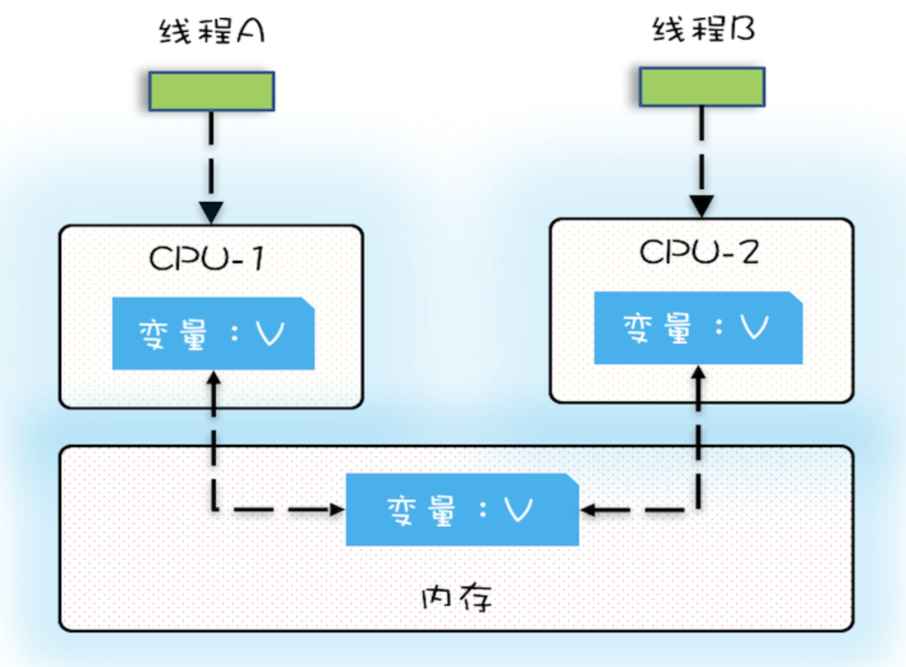
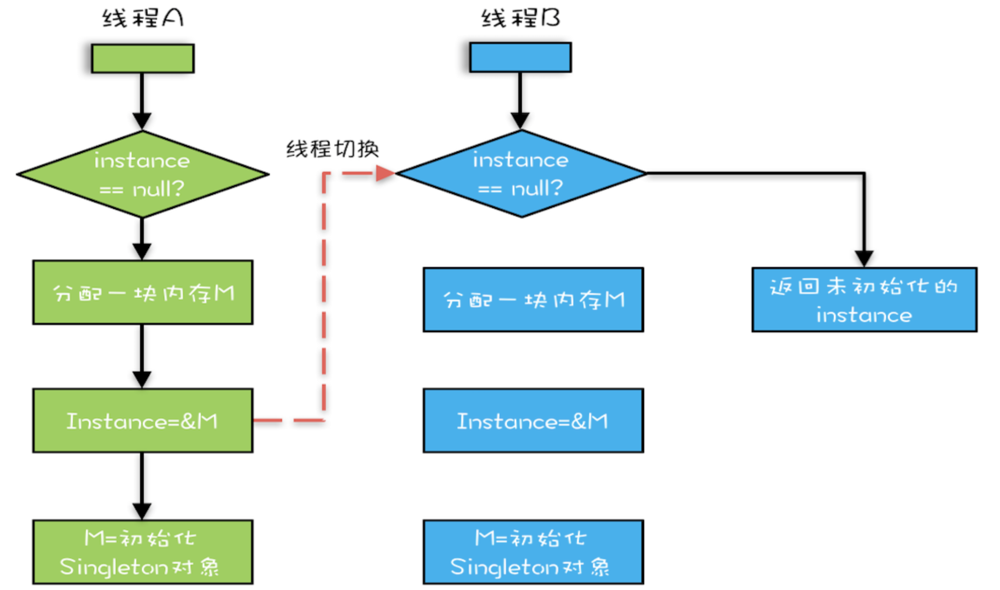
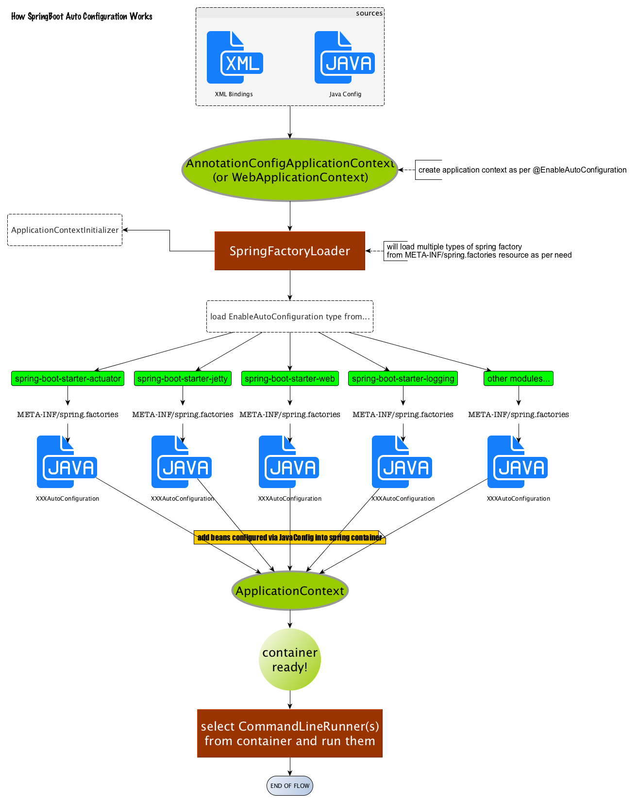
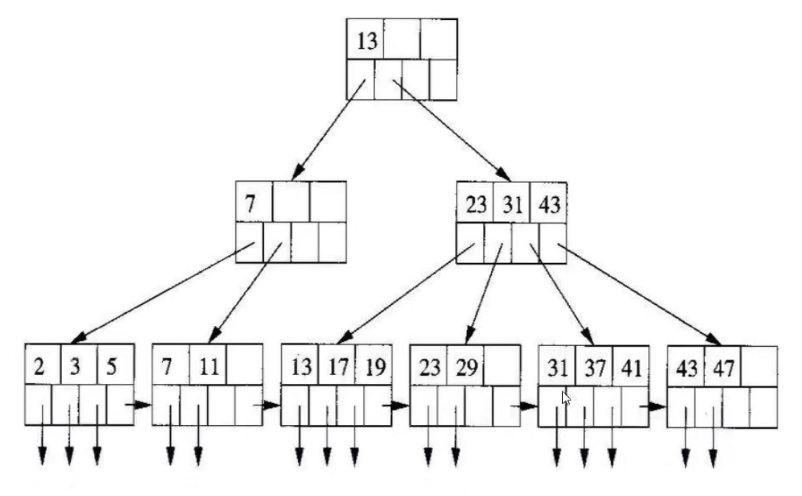
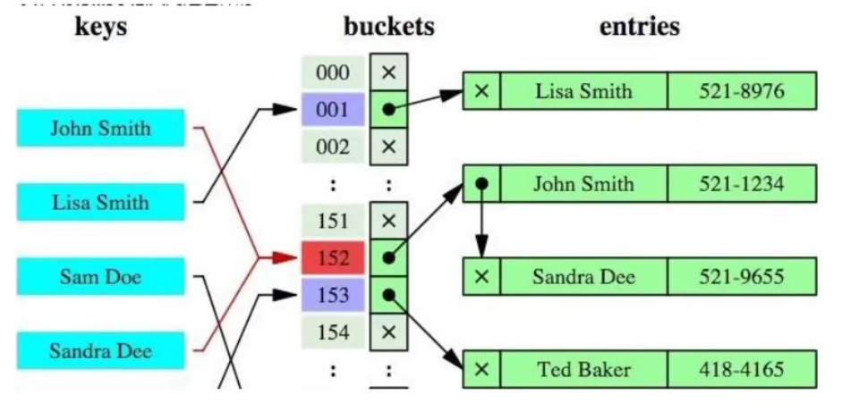

## 一、面向对象

**举例：**洗衣机洗衣服

* 面向过程：1、打开洗衣机 ---> 2、放衣服 ---> 3、放洗衣粉 --->4、清洗 --->5、烘干

* 面向对象：  人：打开洗衣机、放衣服、放洗衣粉

  ​					洗衣机：清洗、烘干

<!-- more -->

**三大特性**

1. **封装**：封装的意义，在于明确标识出允许外部使用的所有成员函数和数据项

   内部细节对外部调用透明，外部调用无需修改或者关心内部实现。

   例如：

   （1）、javabean的属性私有，提供get set方法对外访问，因为属性的赋值或者逻辑只能有javabean本身决定，而不能由外部胡乱修改

   ```java
   private String name;
   public void setName(String name){
   	this.name = "icbc_" + name; //类的内部自己添加前缀，外部不能修改
   }
   ```

   （2）、orm框架

   操作数据库，我们无需关心链接是如何建立的、sql是如何执行的，只需要引入mybatis，调用方法即可

2. **继承**：继承基类的方法，并作出自己的改变和/或扩展

   子类共性的方法或者属性直接使用父类的，而不需要自己再自定义，只需扩展自己个性化的

3. **多态**：基于对象所属类的不同，外部对同一个方法的调用，实际执行的逻辑不同。

   满足条件：继承、方法重写、父类引用指向子类对象

   ```java
   父类类型 变量名 = new 子类对象 ;
   变量名.方法名();
   ```

   但是，无法调用子类特有的方法。

## 二、JDK、JRE、JVM区别和联系



## 三、==和equals比较

* ==对比的是栈中的值，基本数据类型是变量值，引用类型是堆中内存对象的地址
* equals：object中默认也是采用==比较，但通常会重写

Object

```java
public boolean equals(Object obj) {
	return (this == obj);
}
```

String

```java
    public boolean equals(Object anObject) {
        if (this == anObject) {
            return true;
        }
        if (anObject instanceof String) {
            String anotherString = (String)anObject;
            int n = value.length;
            if (n == anotherString.value.length) {
                char v1[] = value;
                char v2[] = anotherString.value;
                int i = 0;
                while (n-- != 0) {
                    if (v1[i] != v2[i])
                        return false;
                    i++;
                }
                return true;
            }
        }
        return false;
    }
```

实际上是比较的字符串里的每个字符

## 四、final

特点：

* 修饰类：表示类不可被继承
* 修饰方法：表示方法不可被子类覆盖，但是可以重载
* 修饰变量：表示变量一旦被赋值就不可以更改它的值。

（1）修饰成员变量

* 如果final修饰的是类变量(static修饰的)，只能在生声明该变量时或者在静态代码块中指定初始值
* 如果修饰的是成员变量，可以在声明该变量、非静态代码块或者构造器中指定初始值。

```java
public class FinalVar {

    final static int a; //类变量在声明时就需要赋值，或者在静态代码块中赋值
    static {
        a = 0;
    }
    final int b; //成员变量在声明该变量、非静态代码块或者构造器中指定初始值。
    {
        b = 0;
    }
}
```

（2）修饰局部变量

*  系统不会为局部变量进行初始化，局部变量必须由程序员显示初始化。因此使用final修饰局部变量时，既可以在定义是指定默认值，也可以不指定，而在后面的代码中对final变量赋初始值（仅一次）。

```java
    public static void main(String[] args) {
        final int localA; //局部变量只声明不初始化，不会报错，与final无关
        localA = 0;     //在使用之前一定要赋值
        //localA = 1;   //不能二次赋值
    }
```

（3）修饰引用类型数据

* 在对其初始化之后，不能再指向另一个对象，但对象内部是可以改变的

```java
final int[] iArr = {1, 2, 3, 4};
iArr[0] = 0; //合法
iArr = null; //非法
```

## 五、String、StringBuffer、StringBuilder

* String是final修饰的，不可变，每次操作都会生成新的String对象
* StringBuffer和StringBuilder都是在原对象上操作
* StringBuffer是线程安全的，StringBuilder是线程不安全的
* StringBuffer方法都是synchronized修饰的

**性能** ：StringBuilder > StringBuffer > String

场景：经常需要改变字符串内容时使用后面两个，优先使用StringBuilder，多线程使用共享变量时使用StringBuffer

## 六、重载和重写

**重载**：同名不同参，方法名相同，参数类型、个数、顺序不同，其他方法返回值，访问修饰符等都没有要求

**重写**： 发生在父子类中，方法名、参数列表必须相同，返回值范围小于等于父类，抛出的异常范围小于等于父类，访问修饰符大于等于父类：

## 七、接口和抽象类

### 1、基本语法区别

Java中接口和抽象类的定义语法分别为interface与abstract关键字。

**抽象类**：在Java中被abstract关键字修饰的类称为抽象类，被abstract关键字修饰的方法称为抽象方法，抽象方法只有方法的声明，没有方法体。抽象类的特点：

* 抽象类不能被实例化只能被继承；
* 包含抽象方法的一定是抽象类，但是抽象类不一定含有抽象方法；
* 抽象类中的抽象方法的修饰符只能为public或者protected，默认为public；
* 一个子类继承一个抽象类，则子类必须实现父类抽象方法，否则子类也必须定义为抽象类；
* 抽象类可以包含属性、方法、构造方法，但是构造方法不能用于实例化，主要用途是被子类调用。

**接口**：Java中接口使用interface关键字修饰，特点为:

* 接口可以包含变量、方法；变量被隐式指定为public static final，方法被隐式指定为public abstract（JDK1.8之前）；
* 接口支持多继承，即一个接口可以extends多个接口，间接的解决了Java中类的单继承问题；
* 一个类可以实现多个接口；
* JDK1.8中对接口增加了新的特性：（1）、默认方法（default method）：JDK 1.8允许给接口添加非抽象的方法实现，但必须使用default关键字修饰；定义了default的方法可以不被实现子类所实现，但只能被实现子类的对象调用；如果子类实现了多个接口，并且这些接口包含一样的默认方法，则子类必须重写默认方法；（2）、静态方法（static method）：JDK 1.8中允许使用static关键字修饰一个方法，并提供实现，称为接口静态方法。接口静态方法只能通过接口调用（接口名.静态方法名）。

**如下例子所示：**

```java
//接口
public interface Person{
  public static final int a=10;
  //JDK1.8
    default void sayHello(){
        System.out.println("Hello World");
    }
    public void say();
}
//抽象类
public abstract class Person{
  public abstract void say();
  public void eat(){};
}
```

如上述代码所示：

接口只能是功能的定义，而抽象类既可以为功能的定义也可以为功能的实现。

**接口的设计目的，是对类的行为进行约束**（准确说是”有“约束，因为接口不能规范类不可以有什么行为），也就是提供一种机制，可以强制的要求不同的类具有相同的行为。它只是约束了行为的有无，但不对如何实现进行限制。

**抽象类的设计目的，是代码复用**。当不同的类具有某些相同的行为（记为行为集合A），且其中一部分行为的实现方式一致时（A的非真子集，记为B），可以让这些类都派生于一个抽象类。在这个抽象类中实现了了B，那所有子类中就可以不用再实现B，这就达到了代码的复用。而A减B的部分，留给各个子类自己实现。也正是因为A-B在这里没有实现，所以抽象类不允许实例化。

**抽象类是对类本质的抽象**，表达的是is a 的关系，比如：BMW is a Car。抽象类包含并实现了子类的通用特性，将子类存在差异化的特性进行抽象，交由子类去实现。

**接口是对行为的抽象**，表达的是like a 的关系，比如： Bird like a Aircraft（像飞行器一样可以飞），但其本质上is a Bird。接口的核心是定义行为，即实现类可以做什么，至于实现类主体是谁、如何实现的，接口并不关心。

使用场景：当你关注一个事物的本质的时候，用抽象类；当你关注一个操作的时候，用接口。

抽象类的功能要远超过接口，但是，定义抽象类的代价高。因为高级语言来说（从实际设计上来说）每个类只能继承一个类，所以在这个顶级抽象类中，你必须继承或编写其所有子类的所有共性。虽然接口在功能上会弱化许多，但是它只是针对一个动作的描述。而且你可以在一个类中同时实现多个接口。在设计阶段会降低难度。

## 八、List和Set

* List：有序，按对象进入的顺序保存对象，可重复，允许多个Null元素对象，可以使用iterator取出所有元素，再逐一遍历，还可以使用get(int index)获取指定下标的元素。
* Set：无序，不可重复，最多允许有一个Null元素对象，取元素时只能用iterator接口取得所有元素，再逐一遍历各个元素。

 ## 九、hashCode与equals

hashCode()的作用是获取哈希码，也被称为散列码，它实际上是返回一个int整数。这个哈希码的作用是确定该对象在哈希表中的索引位置。hashCode()定义在JDK的Object.java中，Java中任何类都包含有hashCode()函数。散列表存储的是键值对(key-value)，它的特点是：能根据“键”快速的检索对应的“值”。这其中就利用了散列码！（可以快速找到所需要的对象）

**为什么要有hashCode？**

举例：**HashSet如何检查重复**

对象加入HashSet时，HashSet会先计算对象的hashCode值来判断对象加入的位置，看该位置是否有值，如果没有值，HashSet会假设对象没有重复出现。但是如果发现有值，这是会调用equals()方法来检查两个对象是否真的相同。如果两者相同，HashSet就不会让其加入成功。如果不同的话，就会重新散列到其他位置。这样就大大减少了equals的次数，提高了执行速度。

* 如果两个对象相等，则hashCode一定相同
* 两个对象相等，对两个对象分别调用equals方法都返回true
* 两个对象有相同的hashCode值，他们也并不一定是相等的
* 因此，equals方法被覆盖过，则hashCode方法也必须被覆盖
* hashCode()的默认行为是对堆上的对象产生独特值，如果没有重写hashCode()，则该class的两个对象无论如何都不会相等（即使这两个对象有相同的数据）

## 十、ArrayList和LinkedList区别

ArrayList：基于动态数组，连续内存存储，适合下标访问（随机访问），扩容机制：因为数组长度固定，超出长度存数据时需要新建数组，然后将老数组的数据拷贝到新数组，如果不是尾部插入数据还会涉及到元素的移动（往后复制一份数据，再插入新元素），但是**使用<u>尾插法</u>并<u>指定初始容量</u>可以极大提升性能，甚至超过LinkedList**（其需要大量创建node对象）

LinkedList：基于链表，可以存储在分散的内存中，适合做数据插入及删除操作，不适合查询（需要逐一遍历）

遍历LinkedList必须使用iterator，不能使用for循环，因为每次for循环体内通过get(i)取得某一元素时都需要堆list重新进行遍历，性能消耗极大。另外不要试图使用indexOf等返回元素索引，并利用其进行遍历，使用indexOf对list进行了遍历，当结果为空时会遍历完整个列表。

```java
public int indexOf(Object o) {
    int index = 0;
    if (o == null) {
        for (Node<E> x = first; x != null; x = x.next) {
            if (x.item == null)
                return index;
            index++;
        }
    } else {
        for (Node<E> x = first; x != null; x = x.next) {
            if (o.equals(x.item))
                return index;
            index++;
        }
    }
    return -1;
}
```

## 十一、HashMap和HashTable区别

区别：

1. HashMap方法没有synchronized修饰，线程非安全，HashTable线程安全
2. HashMap允许key和value为Null，HashTable不允许

底层实现：数组+链表/红黑树

jdk8开始，链表高度到8、数组长度超过64，链表转变为红黑树，元素以内部类Node节点存在

* 计算key的hash值，二次hash然后对数组长度取模，对应到数组下标
* 如果没有产生hash冲突（下标位置没有元素），则直接创建Node存入数组
* 如果产生hash冲突，先进行equals比较，相同则取代该元素，不同，则判断链表高度插入链表，链表高度达到8，并且数组长度到64则转变为红黑树，长度低于6则将红黑树转回链表
* key为null时，存在下标为0的位置
* 数组长度默认为16，负载因子0.75

## 十二、ConcurrentHashMap原理

源码分析详情：https://blog.csdn.net/sihai12345/article/details/79383766

jdk7：

数据结构：ReentrantLock+Segment+HashEntry，一个Segment中包含一个HashEntry数组，每个HashEntry又是一个链表结构

jdk8：

数据结构：synchronize + CAS（乐观锁） + 红黑树，Node的val和next都是用volatile修饰的，保证可见性

查找、替换、赋值都使用CAS

锁：锁数组上的一个元素的链表的head节点，不影响其他元素的读写，锁的粒度更加精细，效率更高。扩容时，阻塞所有的读写操作、并发扩容

读操作无锁：

数组用volatile修饰，保证扩容时被读线程感知。

举例put()操作：

直接放入数组中的空位时，使用CAS。往链表和红黑树上添加元素时，使用synchronized。

```java
public V put(K key, V value) {
    return putVal(key, value, false);
}

final V putVal(K key, V value, boolean onlyIfAbsent) {
    if (key == null || value == null) throw new NullPointerException();
    // 得到 hash 值
    int hash = spread(key.hashCode());
    // 用于记录相应链表的长度
    int binCount = 0;
    for (Node<K,V>[] tab = table;;) {
        Node<K,V> f; int n, i, fh;
        // 如果数组"空"，进行数组初始化
        if (tab == null || (n = tab.length) == 0)
            // 初始化数组，后面会详细介绍
            tab = initTable();

        // 找该 hash 值对应的数组下标，得到第一个节点 f
        else if ((f = tabAt(tab, i = (n - 1) & hash)) == null) {
            // 如果数组该位置为空，
            //    用一次 CAS 操作将这个新值放入其中即可，这个 put 操作差不多就结束了，可以拉到最后面了
            //          如果 CAS 失败，那就是有并发操作，进到下一个循环就好了
            if (casTabAt(tab, i, null,
                         new Node<K,V>(hash, key, value, null)))
                break;                   // no lock when adding to empty bin
        }
        // hash 居然可以等于 MOVED，这个需要到后面才能看明白，不过从名字上也能猜到，肯定是因为在扩容
        else if ((fh = f.hash) == MOVED)
            // 帮助数据迁移，这个等到看完数据迁移部分的介绍后，再理解这个就很简单了
            tab = helpTransfer(tab, f);

        else { // 到这里就是说，f 是该位置的头结点，而且不为空

            V oldVal = null;
            // 获取数组该位置的头结点的监视器锁
            synchronized (f) {
                if (tabAt(tab, i) == f) {
                    if (fh >= 0) { // 头结点的 hash 值大于 0，说明是链表
                        // 用于累加，记录链表的长度
                        binCount = 1;
                        // 遍历链表
                        for (Node<K,V> e = f;; ++binCount) {
                            K ek;
                            // 如果发现了"相等"的 key，判断是否要进行值覆盖，然后也就可以 break 了
                            if (e.hash == hash &&
                                ((ek = e.key) == key ||
                                 (ek != null && key.equals(ek)))) {
                                oldVal = e.val;
                                if (!onlyIfAbsent)
                                    e.val = value;
                                break;
                            }
                            // 到了链表的最末端，将这个新值放到链表的最后面
                            Node<K,V> pred = e;
                            if ((e = e.next) == null) {
                                pred.next = new Node<K,V>(hash, key,
                                                          value, null);
                                break;
                            }
                        }
                    }
                    else if (f instanceof TreeBin) { // 红黑树
                        Node<K,V> p;
                        binCount = 2;
                        // 调用红黑树的插值方法插入新节点
                        if ((p = ((TreeBin<K,V>)f).putTreeVal(hash, key,
                                                       value)) != null) {
                            oldVal = p.val;
                            if (!onlyIfAbsent)
                                p.val = value;
                        }
                    }
                }
            }
            // binCount != 0 说明上面在做链表操作
            if (binCount != 0) {
                // 判断是否要将链表转换为红黑树，临界值和 HashMap 一样，也是 8
                if (binCount >= TREEIFY_THRESHOLD)
                    // 这个方法和 HashMap 中稍微有一点点不同，那就是它不是一定会进行红黑树转换，
                    // 如果当前数组的长度小于 64，那么会选择进行数组扩容，而不是转换为红黑树
                    //    具体源码我们就不看了，扩容部分后面说
                    treeifyBin(tab, i);
                if (oldVal != null)
                    return oldVal;
                break;
            }
        }
    }
    // 
    addCount(1L, binCount);
    return null;
}

```


## 十三、如何实现一个IOC容器

1. 配置文件配置包扫描路径
2. 递归包扫描获取.class文件
3. 反射、确定需要交给IOC管理的类
4. 对需要注入的类进行依赖注入

* 配置文件中指定需要扫描的包路径
* 定义一些注解，分别表示访问控制层、业务持久层、数据持久层、依赖注入层、获取配置文件注解
* 从配置文件中获取需要扫描的包路径，获取到当前路径下的文件信息和文件夹信息，我们将当前路径所有以.class结尾的文件添加到一个Set集合中进行存储
* 遍历这个Set集合，获取在类上有指定注解的类，并将其交给IOC容器，定义一个安全的Map来存储这些对象
* 遍历这个IOC容器，获取到每一个类的实例，判断里面是否有依赖其他类的实例，然后进行递归注入

## 十四、什么是字节码？采用字节码的好处

简单说就是.class文件

java中的编译器和解释器：

java中引入了虚拟机的概念，即在机器和编译程序之间加入了一层抽象的虚拟的机器，这台虚拟机在任何平台上都提供给编译程序一个共同的接口。

编译程序只需要面向虚拟机，生成虚拟机能够理解的代码（.class文件），然后由**解释器**来将虚拟机代码转换为特定系统的机器码执行。

Java源代码---->编译器---->jvm可执行的java字节码---->jvm---->jvm中解释器---->机器可执行的二进制机器码---->程序运行。

采用字节码的好处：

java语言通过字节码的方式，在一定程度上解决了传统解释型语言执行效率低的问题，同时又保留了解释型语言可移植的特点。所以java程序运行时比较高效，而且，由于字节码并不专对一种特定的机器，因此，java一处编译，处处运行。

## 十五、Java类加载器

引导类加载器（bootsrapLoader）：加载bin目录下的jar包和class文件

扩展类加载器（ExtClassLoader）：加载lib/ext目录下的jar包和class文件

应用类加载器（AppClassLoader）：加载classpath路径下的文件

继承ClassLoader实现自定义类加载器，该类有两个核心方法

- loadClass(String, boolean)，实现了**双亲委派机制**

- findClass，默认实现是空方法

  所以我们自定义类加载器主要是**重写findClass方法**。

## 十六、双亲委派模型


**为什么要设计双亲委派机制？**

* 沙箱安全机制：自己写的java.lang.String.class类不会被加载，这样便可以防止核心API库被随意篡改

- 避免类的重复加载：当父亲已经加载了该类时，就没有必要子ClassLoader再加载一次，保证——**被加载类的唯一性**

**全盘负责委托机制**：
“**全盘负责**”是指当一个ClassLoder装载一个类时，除非显示的使用另外一个ClassLoder，该类所依赖及引用的类也由这个ClassLoder载入。

## 十七、Java中的异常体系

Java中所有异常都来自顶级父类Throwable
Throwable下有两个子类：Exception和Error
Error是程序无法处理的错误，一旦出现，程序将被迫停止运行，例如OOM
Exception不会导致程序停止，又分为两个部分RuntimeException运行时异常和CheckedException检查异常
RunTimeException常常发生在程序运行中，会导致当前线程执行失败。
CheckedException常常发生在程序编译过程中，会导致编译不通过。

## 十八、GC如何判断对象可以回收

**可达性分析算法**：将**“GC Roots”** 对象作为起点，从这些节点开始向下搜索引用的对象，找到的对象都标记为**非垃圾对象**，其余未标记的对象都是垃圾对象 。

**GC Roots**根节点：线程栈的本地变量、静态变量、本地方法栈的变量等等 



## 十九、线程的生命周期及状态

线程状态。线程可以处于以下状态之一，一个线程在给定时间点只能处于一种状态。这些状态是不反映任何操作系统线程状态的虚拟机状态。

* NEW ：尚未启动的线程处于此状态
* RUNNABLE ：在Java虚拟机中执行的线程处于这种状态
* BLOCKED：阻塞，等待监视器锁定被阻止的线程处于此状态。
* WAITING ：无限期等待另一线程执行特定操作的线程处于此状态。
* TIMED_WAITING： 在指定等待时间内等待另一线程执行操作的线程处于此状态。
* TERMINATED ：结束状态



## 二十、sleep()、wait()、join()、yield()的区别

1. 锁池

   所有需要竞争同步锁的线程都会放在锁池当中，比如当前对象的锁已经被其中一个线程得到，则其他线程需要在这个锁池进行等待，当前面的线程释放同步锁后，锁池中的线程去竞争同步锁，当某个线程得到后会进入就绪队列进行等待cpu资源分配。

2. 等待池

   当我们调用wait()方法后，线程会放到等待池当中，等待池的线程是不会去竞争同步锁的，只有调用了notify()或notifyAll()后，等待池的线程才会被放到锁池开始竞争同步锁，notify()是随机从等待池中选一个放到锁池，notifyAll()是将等待池的所有线程放到锁池。

* sleep是Thread类的静态本地方法，wait则是Object类的本地方法
* sleep方法不会释放lock，但是wait会释放，而且会加入等待队列中

> sleep就是把cpu的执行资格和执行权释放出去，不再运行此线程，当定时时间结束再取回cpu资源，参与cpu的调度，获取到cpu资源后就可以继续运行。如果在sleep时，该线程持有锁，那么sleep不会释放该锁，而是把锁带着进入冻结状态，其他线程根本不能获取到锁，无法执行程序。如果在睡眠期间其他线程调用了这个线程的interrupt方法，那么这个线程也会抛出interruptexception异常返回，这点和wait一样。

* sleep方法不依赖于同步器synchronized，但是wait需要依赖synchronized关键字（要一起配套使用）。

* sleep不需要被唤醒（休眠之后退出阻塞），但是wait需要（不指定时间的情况下需要）。
* sleep一般用于当前线程休眠，或者轮循暂停操作，wait则多用于多线程之间的通信。
* sleep会让出CPU执行时间且强制上下文切换，而wait则不一定，wait后可能还是有机会重新竞争到锁继续执行的。

yield()执行后线程直接进入就绪状态，马上释放了cpu的执行权，但是依然保留了cpu的执行资格，所以有可能cpu下次进行线程调度还会让这个线程获取到执行权继续执行。

join()执行后当前线程进入阻塞状态，例如在线程B中调用线程A的join()，那线程B会进入到阻塞队列，直到A结束或者中断进程

```java
public static void main(String[] args) throws InterruptedException {
    Thread t1 = new Thread(new Runnable() {
        @Override
        public void run() {
            try {
                Thread.sleep(3000);
            } catch (InterruptedException e) {
                e.printStackTrace();
            }
            System.out.println("222222222");
        }
    });
    t1.start();
    t1.join();
    //这行代码必须要等到t1全部执行完毕，才会执行，即使t1线程休眠了，也要等到它休眠结束代码执行完毕。
    System.out.println("111111");
}

结果：
    222222222
    111111
```

## 二十一、对线程安全的理解

注意：不是线程安全、应该是内存安全，堆是共享内存，可以被所有线程访问

> 当多个线程访问同一个对象时，如果不用进行额外的同步控制或其他的协调操作，调用这个对象的行为都可以获得正确的结果，我们就说这个对象是线程安全的。

## 二十二、Thread、Runnable的区别

Thread和Runnable的实质是继承关系，没有可比性。无论使用Runnable还是Thread，都会new Thread，然后执行run方法。用法上，如果有复杂的线程操作要求，那就选择继承Thread，如果只是简单的执行一个任务，那就实现Runnable。

## 二十三、守护线程（Daemon Thread）

https://www.cnblogs.com/xiarongjin/p/8310144.html

守护线程：为所有非守护线程（用户线程）提供服务的线程；任何一个守护线程都是整个JVM中所有用户线程的保姆；

守护线程的生死无关紧要，它依赖整个进程而运行，如果其他线程都结束了，程序就结束了，直接就会中断守护线程。

**注意**：由于守护线程的终止是自身无法控制的，因此千万不要把IO、File等重要的操作逻辑分给它，因为不靠谱。

守护线程举例：GC垃圾回收线程：当我们的系统不再有任何运行的Thread，程序就不会再产生垃圾，垃圾回收器就无事可做，所以当垃圾回收线程是JVM上仅剩的线程时，垃圾回收线程会自动结束。

1. thread.setDaemon(true)必须在thread.start()之前设置，否则会跑出一个IllegalThreadStateException异常。你不能把正在运行的常规线程设置为守护线程。 

2. 在Daemon线程中产生的新线程也是Daemon的。

3. 守护线程应该永远不去访问固有资源，如文件、数据库，因为它会在任何时候甚至在一个操作的中间发生中断。

## 二十四、ThreadLocal的原理和使用场景

https://www.zhihu.com/question/341005993

每一个Thread对象均含有一个ThreadLocalMap类型的成员变量threadLocals，它存储本线程中所有ThreadLocal对象(key)及其对应到值(value)

ThreadLocalMap由一个个Entry对象组成
Entry继承自WeakReference<ThreadLocal<?>>，一个Entry由ThreadLocal对象和Object构成。由此可见，Entry的key是ThreadLocal对象，value是调用set方法时设置的值。Entry的key是是一个弱引用。当没有指向key的强引用后，该key就会被垃圾收集器回收，但是value不会被回收，这个时候ThreadLocalMap中就可能存在key为null但是value不为null的项，这需要**实际的时候使用完毕及时调用remove方法避免内存泄漏**。

**ThreadLocal**的简单使用：

```java
public class ThreadLocalTest {

    static ThreadLocal<String> localVar = new ThreadLocal<>();

    static void print() {
        Thread thread = Thread.currentThread();
        System.out.println(thread.getName() + ":" + localVar.get()); //打印当前线程中本地内存中本地变量的值
        //localVar.remove(); //清除本地内存中的本地变量
    }

    public static void main(String[] args) throws InterruptedException {
        Thread threadA = new Thread(new Runnable() {
            @Override
            public void run() {
                localVar.set("线程A的本地变量"); //设置线程A中本地变量的值
                print();
            }
        }, "ThreadA");

        Thread threadB = new Thread(new Runnable() {
            @Override
            public void run() {
                //localVar.set("线程B的本地变量"); //设置线程B中本地变量的值
                print();
            }
        }, "ThreadB");

        threadA.start();
        threadA.join(); //先执行完A线程再执行B线程
        threadB.start();
    }
}
```

运行结果：

```
ThreadA:线程A的本地变量
ThreadB:null
```

可以看出，每个线程的ThreadLocal是独立的，线程之间互不影响。

**总结作用**：ThreadLocal的作用主要是做数据隔离，填充的数据只属于当前线程，变量的数据对别的线程而言是相对隔离的，在多线程环境下，如何防止自己的变量被其它线程篡改。

使用场景：

1. 在使用对象跨层传递的时候，使用ThreadLocal可以避免多次传递，打破层次间的约束。
2. 线程间数据隔离
3. 进行事务操作，用于存储线程事务信息
4. 数据库连接，Session会话管理。

> Spring框架在事务开始时会给当前线程绑定一个Jdbc Connection，在整个事务过程中都是使用该线程绑定的connection来执行数据库操作，实现了事务的隔离性，Spring框架里就是使用ThreadLocal来实现这种隔离的

## 二十五、ThreadLocal内存泄漏

介绍一下弱引用：

>  只具有弱引用的对象拥有更短暂的生命周期，在垃圾回收器线程扫描它所管辖的内存区域的过程中，一旦发现了只具有弱引用的对象，不管当前内存空间足够与否，都会回收它的内存。  不过，由于垃圾回收器是一个优先级很低的线程，因此不一定会很快发现那些只具有弱引用的对象。  

这就导致了一个问题，ThreadLocal在没有外部强引用时，发生GC时会被回收，如果创建ThreadLocal的线程一直持续运行，那么这个Entry对象中的value就有可能一直得不到回收，发生内存泄露。

就比如线程池里面的线程，线程都是复用的，那么之前的线程实例处理完之后，出于复用的目的线程依然存活，所以，ThreadLocal设定的value值被持有，导致内存泄露。

按照道理一个线程使用完，ThreadLocalMap是应该要被清空的，但是现在线程被复用了。

### **那怎么解决？**

在代码的最后使用remove就好了，我们只要记得在使用的最后用remove把值清空就好了。

```java
ThreadLocal<String> localName = new ThreadLocal();
try {
    localName.set("张三");
    ……
} finally {
    localName.remove();
}
```

作者：敖丙
链接：https://www.zhihu.com/question/341005993/answer/1367225682

## 二十六、并发、并行、串行的区别

* 串行：在时间上不可能发生重叠，前一个任务没有完成，下一个任务只能等待。
* 并行：在时间上重叠，两个任务在同一时刻互不干扰的同时执行。
* 并发：允许两个任务彼此干扰，同一时间，只有一个任务运行，按照cpu调度交替执行。

## 二十七：并发的三大特性

https://www.jianshu.com/p/a529f47d8103

原子性、可见性、有序性

* 原子性：

是指在一个操作中cpu不可以在中途暂停然后再调度，即不被中断操作，要么全部执行，要么都不执行。

```java
private long count = 0;

public void calc(){
	count++;
}
```

例子 针对代码 count+=1;至少需要三条 CPU 指令.

1. 将count的值从内存中读取到寄存器中。

2. 在寄存器中进行+1操作。

3. 将结果写入内存中。

但是当上述三个过程中线程A 刚执行完步骤（1）后，进行了线程切换，线程B重新执行上述操作，最后内存中存储的数据是1而不是2。具体流程如图所示。



* 可见性

一个线程对共享变量的修改，另外一个线程能够立刻看到，我们称为可见性。

每颗 CPU 都有自己的缓存，这时 CPU 缓存与内存的数据一致性就没那么容易解决了，当多个线程在不同的 CPU 上执行时，这些线程操作的是不同的 CPU 缓存。比如下图中，线程 A 操作的是 CPU-1 上的缓存，而线程 B 操作的是 CPU-2 上的缓存，很明显，这个时候线程 A 对变量 V 的操作对于线程 B 而言就不具备可见性了。



可见性代码示例：

```java
public class ConcurrencyTest {

    private static int count = 0;

    void add() {
        int idx = 0;
        while (idx++ < 10000) {
            count += 1;
        }
    }

    public static void main(String[] args) throws InterruptedException {
        final ConcurrencyTest test = new ConcurrencyTest();
        // 创建两个线程，执行add()操作
        Thread th1 = new Thread(() -> {
            test.add();
        });

        Thread th2 = new Thread(() -> {
            test.add();
        });

        // 启动两个线程
        th1.start();
        th2.start();
        // 等待两个线程执行结束
        th1.join();
        th2.join();
        System.out.println(count);
    }
}
```

* 有序性

有序性指的是程序按照代码的先后顺序执行。编译器为了优化性能，有时候会改变程序中语句的先后顺序，但是不会影响最终的执行结果。有序性比较经典的例子就是利用双重检查创建单例对象。

例如：

```java
package JVMDemo;

public class SingletonTest {
    //定义一个INSTANCE，不new
    private static volatile SingletonTest instance; //volatile关键字禁止指令重排，保证有序性。

    //构造方法设为私有的，不让别人new
    private SingletonTest() {
    }

    //给一个getInstance方法，
    public static SingletonTest getInstance() {
        if (instance == null) {
            //对当前类加锁
            synchronized (SingletonTest.class) {
                if (instance == null) {
                    instance = new SingletonTest();
                }
            }
        }
        return instance;
    }

    /**
     * 检验是否正确
     *
     * @param args
     */
    public static void main(String[] args) {
        for (int i = 0; i < 100; i++) {
            new Thread(() -> System.out.println(SingletonTest.getInstance().hashCode())
            ).start();
        }
    }

}

```

示例来源：https://blog.csdn.net/qq_43234517/article/details/108086364

在Java创建对象的时候主要进行以下几个步骤：

1. 分配一块内存区域W；
2. 在内存W上初始化 Singleton 对象；
3. 然后 W 的地址赋值给 instance 变量。

但是Java在编译的时候会进行编译优化，把方法的执行顺序修改成

1. 分配一块内存区域W；
2. 然后 W 的地址赋值给 instance 变量。
3. 在内存W上初始化 Singleton 对象；

如果线程A按照优化好的逻辑执行到第（2）步骤给开辟的内存地址分配给instance对象后，线程B的请求也打过来，此时getInstance()方法时 instance 是不等于null的，线程B会认为已经创建好单例对象，直接返回，后面的业务代码在进行对象操作的时候会出现空指针的问题。具体流程如下图所示。



解决方案：instance变量声明时加volatile关键字，禁止指令重排。

作者：yfsheng
链接：https://www.jianshu.com/p/a529f47d8103
来源：简书

## 二十八、为什么使用线程池、解释参数

1. 降低资源消耗：提高线程利用率，降低创建的销毁线程的消耗。
2. 提高响应速度：任务来了，直接有线程可用可执行，而不是先创建线程，再执行。
3. 提高线程的可管理性：线程是稀缺资源，使用线程池可以统一分配调优监控。

复用原理：

线程池将线程和任务解耦，线程是线程，任务是任务，摆脱了之前通过Thread创建线程时必须对应一个任务的限制。在线程池中，同一个线程可以从阻塞队列中不断获取新任务来执行。

线程池参数：

1. corePoolSize（线程池核心线程数）：必须大于或等于0；当向线程池提交一个任务时，若线程池已创建的线程数小于corePoolSize，即便此时存在空闲线程，也会通过创建一个新线程来执行该任务，直到已创建的线程数大于或等于corePoolSize时，才会根据是否存在空闲线程，来决定是否需要创建新的线程。除了利用提交新任务来创建和启动线程（按需构造），也可以通过 prestartCoreThread() 或 prestartAllCoreThreads() 方法来提前启动线程池中的基本线程。

2. maximumPoolSize（线程池最大线程数）：必须大于或等于核心线程数；线程池所允许的最大线程个数。当队列满了，且已创建的线程数小于maximumPoolSize，则线程池会创建新的线程来执行任务。另外，对于无界队列，可忽略该参数。

3. keepAliveTime（线程存活保持时间）默认情况下，当线程池的线程个数多于corePoolSize时，线程的空闲时间超过keepAliveTime则会终止。但只要keepAliveTime大于0，allowCoreThreadTimeOut(boolean) 方法也可将此超时策略应用于核心线程。另外，也可以使用setKeepAliveTime()动态地更改参数。

4. unit（存活时间的单位）：时间单位，分为7类，从细到粗顺序：NANOSECONDS（纳秒），MICROSECONDS（微妙），MILLISECONDS（毫秒），SECONDS（秒），MINUTES（分），HOURS（小时），DAYS（天）；

5. workQueue（任务队列）：用于传输和保存等待执行任务的阻塞队列。可以使用此队列与线程池进行交互：
   * 如果运行的线程数少于 corePoolSize，则 Executor 始终首选添加新的线程，而不进行排队。
   * 如果运行的线程数等于或多于 corePoolSize，则 Executor 始终首选将请求加入队列，而不添加新的线程。
   * 如果无法将请求加入队列，则创建新的线程，除非创建此线程超出 maximumPoolSize，在这种情况下，任务将被拒绝。

6. threadFactory（线程工厂）不能为空，默认为DefaultThreadFactory类；用于创建新线程。由同一个threadFactory创建的线程，属于同一个ThreadGroup，创建的线程优先级都为Thread.NORM_PRIORITY，以及是非守护进程状态。threadFactory创建的线程也是采用new Thread()方式，threadFactory创建的线程名都具有统一的风格：`pool-m-thread-n`（m为线程池的编号，n为线程池内的线程编号）;

7. handler（线程饱和策略）不能为空，默认策略为ThreadPoolExecutor.AbortPolicy；当线程池和队列都满了，则表明该线程池已达饱和状态。
   * ThreadPoolExecutor.AbortPolicy：处理程序遭到拒绝，则直接抛出运行时异常 RejectedExecutionException。(默认策略)
   * ThreadPoolExecutor.CallerRunsPolicy：调用者所在线程来运行该任务，此策略提供简单的反馈控制机制，能够减缓新任务的提交速度。
   * ThreadPoolExecutor.DiscardPolicy：无法执行的任务将被删除。
   * ThreadPoolExecutor.DiscardOldestPolicy：如果执行程序尚未关闭，则位于工作队列头部的任务将被删除，然后重新尝试执行任务（如果再次失败，则重复此过程）。

## 二十九、线程池用法

http://gityuan.com/2016/01/16/thread-pool/

`Executors`类提供了4种不同的线程池：

* newCachedThreadPool：创建一个可缓存的无界线程池，该方法无参数。
* newFixedThreadPool：创建一个固定大小的线程池
* newSingleThreadExecutor：创建一个只有一个线程的线程池
* newScheduledThreadPool：创建一个可定时执行或周期执行任务的线程池

详细介绍：

1. newCachedThreadPool：创建一个可缓存的无界线程池，该方法无参数。当线程池中的线程的空闲时间超过60秒，则会回收该线程，回收完毕，线程池中没有线程时，线程池自动销毁。当任务超过线程池的线程数则创建新线程。线程池的大小上限为Integer.MAX_VALUE，可以看作无限大。

   ~~~java
   public void cachedThreadDemo() {
           ThreadPoolExecutor cachedThreadPool = (ThreadPoolExecutor) Executors.newCachedThreadPool();
           for (int i = 0; i < 20; i++) {
               final int index = i;
               Runnable runnable = () -> System.out.println(Thread.currentThread().getName() + ", index=" + index);
               cachedThreadPool.execute(runnable);
           }
           System.out.println("PoolSize1:"+cachedThreadPool.getPoolSize()); //线程池中线程数量
           System.out.println("completedTaskCount:"+cachedThreadPool.getCompletedTaskCount()); //线程池在运行过程中已完成的任务数量
           System.out.println("largestPoolSize:"+cachedThreadPool.getLargestPoolSize()); //线程池曾经创建过的最大线程数量
           System.out.println("ActiveCount:"+cachedThreadPool.getActiveCount()); //获取活动的线程数
           try {
               Thread.sleep(61000);
           } catch (InterruptedException e) {
               e.printStackTrace();
           }
           System.out.println("PoolSize2:"+cachedThreadPool.getPoolSize());
           System.out.println("ActiveCount:"+cachedThreadPool.getActiveCount());
       }
   ~~~

   运行结果：

   ~~~
   pool-1-thread-1, index=0
   pool-1-thread-2, index=1
   pool-1-thread-3, index=2
   pool-1-thread-5, index=4
   pool-1-thread-4, index=3
   PoolSize1:5
   completedTaskCount:3
   largestPoolSize:5
   ActiveCount:0
   PoolSize2:0
   ActiveCount:0
   ~~~

2. newFixedThreadPool

   创建一个固定大小的线程池，该方法可指定线程池的固定大小，对于超出的线程会在LinkedBlockingQueue队列中等待。

   ~~~java
   public static void fixedThreadPool(){
       ThreadPoolExecutor fixedThreadPool = (ThreadPoolExecutor) Executors.newFixedThreadPool(2);
       for (int i = 0; i < 5; i++) {
           final int index = i;
           Runnable runnable = () -> System.out.println(Thread.currentThread().getName() + ", index=" + index);
           fixedThreadPool.execute(runnable);
           try {
               Thread.sleep(1000);
           } catch (InterruptedException e) {
               e.printStackTrace();
           }
       }
   }
   ~~~

   运行结果：

   ~~~
   pool-1-thread-1, index=0
   pool-1-thread-2, index=1
   pool-1-thread-1, index=2
   pool-1-thread-2, index=3
   pool-1-thread-1, index=4
   ~~~

3. newSingleThreadExecutor

   创建一个只有一个线程的线程池，方法无参，所有的任务都保存队列LinkedBlockingQueue中，等待唯一的单线程来执行任务，并保证所有任务按照指定顺序（FIFO或 优先级）执行。

   ~~~java
   public static void singleThreadExecutorDemo() {
       ExecutorService singleThreadExecutor = Executors.newSingleThreadExecutor();
       for (int i = 0; i < 3; i++) {
           final int index = i;
           Runnable runnable = () -> System.out.println(Thread.currentThread().getName() + ", index=" + index);
           singleThreadExecutor.execute(runnable);
           try {
               Thread.sleep(1000);
           } catch (InterruptedException e) {
               e.printStackTrace();
           }
       }
   }
   ~~~

   运行结果：

   ~~~
   pool-1-thread-1, index=0
   pool-1-thread-1, index=1
   pool-1-thread-1, index=2
   ~~~

4. newScheduledThreadPool

   创建一个可定时执行或周期执行任务的线程池，该方法可指定线程池的核心线程个数。

   ~~~java
   public static void scheduledThreadPool() {
       ScheduledExecutorService threadPool = Executors.newScheduledThreadPool(3);
       //定时执行一次的任务，延迟1s后执行
       Runnable runnable2 = () -> System.out.println(Thread.currentThread().getName() + ", delay 1s");
       threadPool.schedule(runnable2, 1, TimeUnit.SECONDS);
       //周期性地执行任务，延迟2s后，每3s一次地周期性执行任务
       Runnable runnable3 = () -> System.out.println(Thread.currentThread().getName() + ", every 3s");
       threadPool.scheduleAtFixedRate(runnable3, 2, 3, TimeUnit.SECONDS);
   }
   ~~~

   运行结果：

   ~~~
   pool-1-thread-1, delay 1s
   pool-1-thread-2, every 3s
   pool-1-thread-1, every 3s
   pool-1-thread-1, every 3s
   pool-1-thread-1, every 3s
   ...不断运行下去
   ~~~

   - schedule(Runnable command, long delay, TimeUnit unit)，延迟一定时间后执行Runnable任务；
   - schedule(Callable callable, long delay, TimeUnit unit)，延迟一定时间后执行Callable任务；
   - scheduleAtFixedRate(Runnable command, long initialDelay, long period, TimeUnit unit)，延迟一定时间后，以间隔period时间的频率周期性地执行任务；
   - scheduleWithFixedDelay(Runnable command, long initialDelay, long delay,TimeUnit unit)，与scheduleAtFixedRate()方法很类似，但是不同的是scheduleWithFixedDelay()方法的周期时间间隔是以上一个任务执行结束到下一个任务开始执行的间隔，而scheduleAtFixedRate()方法的周期时间间隔是以上一个任务开始执行到下一个任务开始执行的间隔，也就是这一些任务系列的触发时间都是可预知的。

**排队有三种通用策略：**

- 直接提交。工作队列的默认选项是 SynchronousQueue，它将任务直接提交给线程而不保持它们。在此，如果不存在可用于立即运行任务的线程，则试图把任务加入队列将失败，因此会构造一个新的线程。此策略可以避免在处理可能具有内部依赖性的请求集时出现锁。直接提交通常要求无界 maximumPoolSizes 以避免拒绝新提交的任务。当命令以超过队列所能处理的平均数连续到达时，此策略允许无界线程具有增长的可能性。
- 无界队列。使用无界队列（例如，不具有预定义容量的 LinkedBlockingQueue）将导致在所有 corePoolSize 线程都忙时新任务在队列中等待。这样，创建的线程就不会超过 corePoolSize。（因此，maximumPoolSize 的值也就无效了。）当每个任务完全独立于其他任务，即任务执行互不影响时，适合于使用无界队列；例如，在 Web 页服务器中。这种排队可用于处理瞬态突发请求，当命令以超过队列所能处理的平均数连续到达时，此策略允许无界线程具有增长的可能性。
- 有界队列。当使用有限的 maximumPoolSizes 时，有界队列（如 ArrayBlockingQueue）有助于防止资源耗尽，但是可能较难调整和控制。队列大小和最大池大小可能需要相互折衷：使用大型队列和小型池可以最大限度地降低 CPU 使用率、操作系统资源和上下文切换开销，但是可能导致人工降低吞吐量。如果任务频繁阻塞（例如，如果它们是 I/O 边界），则系统可能为超过您许可的更多线程安排时间。使用小型队列通常要求较大的池大小，CPU 使用率较高，但是可能遇到不可接受的调度开销，这样也会降低吞吐量。

## 三十、线程池中阻塞队列的作用，为什么先添加队列而不是创建最大线程

1. * 一般队列只能保证一个有限的长度作为任务缓冲区，超出缓冲长度，就无法保留任务了，而阻塞队列通过阻塞，保留住想继续入队的任务。
   * 阻塞队列可以保证任务队列中没有任务时，阻塞获取任务的线程，使其进入wait状态，释放cpu资源
   * 阻塞队列自带阻塞和唤醒功能，无需额外处理，无任务时，线程池利用阻塞队列的take方法挂起，维持核心线程存活，释放cpu资源。

2. 在创建新线程时，需要获取全局锁，此时其他的就要阻塞，影响效率。

   例如：工厂10名正式工，任务满了先积压订单，实在做不完了，再找外包团队。

## 三十一、线程池的优化

需要针对具体情况而具体处理，不同的任务类别应采用不同规模的线程池，任务类别可划分为CPU密集型任务、IO密集型任务和混合型任务。

线程池的大小设置，可参照：**Runtime.getRuntime().availableProcessors()**，返回的是可用的计算资源N，而不是CPU物理核心数，对于支持超线程的CPU来说，单个物理处理器相当于拥有两个逻辑处理器，能够同时执行两个线程。

- 对于CPU密集型任务：线程池中线程个数应尽量少，不应大于CPU核心数，**推荐设置线程池核心线程数为N**，也就是和cpu的线程数相同，可以尽可能低避免线程间上下文切换。
- 对于IO密集型任务：由于IO操作速度远低于CPU速度，那么在运行这类任务时，CPU绝大多数时间处于空闲状态，那么线程池可以配置尽量多些的线程，以提高CPU利用率，**推荐设置线程池核心线程数为2N**，但是这个数一般根据业务压测出来的，如果不涉及业务就使用推荐。
- 对于混合型任务：可以拆分为CPU密集型任务和IO密集型任务，当这两类任务执行时间相差无几时，通过拆分再执行的吞吐率高于串行执行的吞吐率，但若这两类任务执行时间有数据级的差距，那么没有拆分的意义。

## 三十二、spring是什么

轻量级的开源的J2EE框架，是一个容器框架，用来装javabean（java对象），中间层框架（万能胶）可以起连接作用，比如将strus和hibernate粘合在一起使用。

spring是一个轻量级的控制反转（IOC）和面向切面（AOP）的容器框架。

## 三十三、谈谈AOP的理解

系统是由许多不同的组件组成的，每一个组件负责一块特定的功能。

当我们需要为分散的对象引入公共的行为时，oop显得无能为力，例如添加日志功能。

日志代码往往水平的散布在所有对象层次中，而与他所散布的核心功能毫无关系。在oop设计中，它导致了大量代码的重复，而不利于各个模块的重用。

AOP：将程序中的交叉业务逻辑（比如权限，日志，事务等），封装成一个切面，然后注入到目标对象（具体业务逻辑）中去，AOP可以对某个对象或某些对象的功能进行增强，比如对象中的方法进行增强，可以在执行某个方法之前或之后额外做一些事情。

## 三十四、谈谈IOC

三个方面：容器概念、控制反转、依赖注入

IOC容器：实际上是一个map（key-value结构），里面存的是各种对象（在xml中配置的bean节点，或者@Repository、@Service、@Controller、@Component），在项目启动时会读取配置文件中的bean节点，根据全限定类名使用反射创建对象放到map中去，或者扫描到有上述注解的类也通过反射创建对象放到map中去。

之后map中有了很多对象，接下来在我们代码里需要用到某个对象时，通过DI注入（@Autowired、@Resource等注解，或xml中配置bean节点内的ref属性，项目启动时会根据类型或者id注入；id就是对象名）

## 三十五、BeanFactory和ApplicationContext的区别

* BeanFactory采用的时延迟加载形式注入Bean，即在使用时才会实例化。
* ApplicationContext，在容器启动时，一次性创建所有的Bean，有利于在启动时发现配置错误，并且通过预先载入单例bean，确保需要用的时候，不用等待。
* 相对于基本的BeanFactory，ApplicationContext唯一的不足是占用内存空间，当配置的Bean较多时，程序启动较慢。
* BeanFactory通常以编程的方式被创建，ApplicationContext还能以声明的方式创建，例如使用ContextLoader。
* 两者都支持BeanPostProcessor、BeanFactoryPostProcessor的使用，但两者区别是：BeanFactory需要手动注册，而ApplicationContext则是自动注册。

## 三十六、spring bean生命周期

1. 解析类得到BeanDefinition
2. 如果有多个构造方法，则要推断方法
3. 确定好构造方法后，实例化得到对象。Instantiation
4. 对象中加了@Autowired注解的属性进行填充；Populate
5. 回调Aware方法，比如BeanNameAware，BeanFactoryAware
6. 调用BeanPostProcessor的初始化前的方法
7. 调用初始化方法；Initialization
8. 调用BeanPostProcessor的初始化后的方法，在这里会进行Aop
9. 如果当前创建的bean是单例的则会放入单例池
10. 使用bean
11. Spring容器关闭时调用DisposableBean中的destory()方法；Destruction

## 三十七、spring支持的bean的作用域

* singleton：默认，每个容器中只有一个bean的实例，单例的模式由BeanFactory自身来维护。该对象生命周期是与IOC容器一致的（但在第一次被注入时才会创建）
* prototype：为每一个bean请求提供一个实例，每次注入时都会注入新的对象。
* request：bean被定义为在每个Http请求中创建一个单例对象，也就是说在单个请求中都会复用这一个单例对象
* session：与request范围类似，确保每个session中有一个bean的实例，在session过期后，bean会随之失效
* application：bean被定义为在ServletContext的生命周期中复用一个单例对象。
* websocket：bean被定义为在websocket的生命周期中复用一个单例对象

## 三十八、spring中的单例bean是线程安全的吗？

不是

## 三十九、spring中用了哪些设计模式

简单工厂：

工厂方法：

单例模式：

适配器模式：

装饰者模式：

动态代理：

> 切面在运行的时刻被织入，一般情况下，在织入切面时，AOP容器会为动态的目标对象创建一个代理对象

观察者模式：

> spring的事件驱动模型，例如listener的实现

策略模式：

## 四十、spring事务的实现方式原理以及隔离级别

两种实现方式：编程式、声明式（@Transactional）

在一个方法上加了@Transactional注解后，spring会基于这个类生成一个代理对象，会将这个代理对象作为bean，当在使用这个代理对象的方法时，如果这个方法上存在@Transactional注解，那么代理逻辑会把事务的自动提交设为false，然后再去执行原本的逻辑方法，如果执行业务逻辑方法没有出现异常，那么代理逻辑中就会将事务进行提交，如果执行业务逻辑方法出现异常，那么会进行事务回滚

当然针对哪些异常回滚事务是可以配置的，可以利用@Transactional注解中的rollbackFor属性进行配置，默认情况下会对RuntimeException和Error进行回滚

spring事务隔离级别就是数据库的隔离级别：外加一个默认级别

* read uncommitted（读未提交）
* read committed（读已提交）
* repeatable read（可重复度）
* serializable（可串行化）

> 数据库的配置隔离级别是read committed，而spring配置的隔离级别是repeatable read，最后以spring的配置为准

## 四十一、 spring的事务传播机制

多个事务方法相互调用时，事务是如何在这些方法间传播

> 方法A是一个事务的方法，方法A执行过程中调用了方法B，那么方法B有无事务以及方法B对事务的要求不同都会对方法A的事务具体执行造成影响，同时方法A的事务对方法B的事务执行也有影响，这种影响具体是什么就由两个方法所定义的事务传播类型所决定。

**注意：**以下举例都是修饰B方法的，场景为A方法中去调用B方法。

required（默认）：如果A没有事务，B有事务，那么就B就新建一个事务，如果A有事务，则B加入这个事务。

supports：如果A有事务，则B加入该事务，如果A没有事务，则B也不再开启事务

mandatory：

requires_new：B直接创建一个新事物，如果A已经有事务，则挂起该事务。

not_supported：以非事务方式执行，如果A存在事务，则挂起该事务。

never：不使用事务，如果A存在事务，则抛出异常。

nested：如果A有事务存在，则在嵌套事务中执行；如果A没有事务，那么B新建一个事务（同required）。

## 四十二、spring事务什么时候会失效

https://www.jianshu.com/p/4120b89190d0

spring事务的原理是AOP，进行了切面增强，生成了代理类，失效的根本原因就是这个AOP不起作用了

1. 发生自调用，在类A里面有方法a 和方法b，然后方法b上面用@Transactional加了方法级别的事务，在方法a里面 调用了方法b， 方法b里面的事务不会生效。

   原理：Spring在扫描Bean的时候会自动为标注了@Transactional注解的类生成一个代理类(proxy),当有注解的方法被调用的时候，实际上是代理类调用的，代理类在调用之前会开启事务，执行事务的操作。但是同一个类中的方法互相调用，相当于this.B()，此时的B方法并非是代理类调用，而是直接通过原有的Bean直接调用，所以注解会失效。

2. 方法不是public的，对于非public方法如果非要使用，可以考虑用AspectJ

3. 数据库不支持事务

4. 该类没有被spring管理，（例如没有@Service注解）

5. 异常被吃掉，事务不会回滚

6. 异常类型错误或格式配置错误

   ```java
   @Service
   public class OrderServiceImpl implements OrderService {
    @Transactional
      // @Transactional(rollbackFor = SQLException.class)
       public void updateOrder(Order order) {
           try {            // update order
             }catch (Exception e){
              throw new Exception("更新错误");        
           }    
       }
   }
   ```

   这样事务也是不生效的，因为默认回滚的是：RuntimeException，如果你想触发其他异常的回滚，需要在注解上配置一下，如：

   ```java
   @Transactional(rollbackFor = Exception.class)
   ```

   这个配置仅限于 `Throwable` 异常类及其子类。

作者：一个忙来无聊的人
链接：https://www.jianshu.com/p/4120b89190d0
来源：简书

## 四十三、bean的自动装配、有哪些方式


## 四十四、 spring、springmvc、springboot区别


## 四十五、 springmvc工作流程


## 四十六、springmvc的九大件

Handler：也就是处理器。它直接对应着MVC中的C，也就是Controller层，它的具体表现形式有很多，可以是类，可以是方法。在Controller层中@RequestMapping标注的所有方法都可以看成是一个Handler，只要可以实际处理请求就可以是Handler

1. HandlerMapping：处理器映射器
2. HandlerAdapter：处理器适配器
3. HandlerExceptionResolver:
4. ViewResolver：视图解析器
5. 。。。

## 四十七、springboot自动配置原理

Spring Boot启动的时候会通过@EnableAutoConfiguration注解找到META-INF/spring.factories配置文件中的所有自动配置类，并对其进行加载，而这些自动配置类都是以AutoConfiguration结尾来命名的，它实际上就是一个JavaConfig形式的Spring容器配置类，它能通过以Properties结尾命名的类中取得在全局配置文件中配置的属性如：server.port，而XxxxProperties类是通过@ConfigurationProperties注解与全局配置文件中对应的属性进行绑定的。

原文链接：https://blog.csdn.net/u014745069/article/details/83820511

## 四十八、如何理解springboot的starter


## 四十九、什么是嵌入式服务器、为何使用

节省了下载安装tomcat，应用也不需要再打war包，然后放到webapp目录下再运行

只需要一个安装了java虚拟机，就可以直接在上面部署应用程序了

springboot已经内置了tomcat.jar，运行main方法时会去启动tomcat，并利用tomcat的spi机制加载springmvc

## 五十、mybatis的优缺点


## 五十一、mybatis和hibernate的对比


## 五十二、#{}和${}的区别

#{}是预编译处理、是占位符，会将sql中的#{}替换为？号防止sql注入，${}是字符串替换、是拼接符。

## 五十三、mybatis插件运行原理及开发流程


## 五十四、索引的基本原理

索引是用来快速寻找那些具有特定值的记录。如果没有索引，一般来说执行查询时遍历整张表。

索引的原理：就是把无序的数据变成有序的查询

1. 把创建了索引的列的内容进行排序
2. 对排序结果生成倒排表
3. 在倒排表内容上拼上数据地址连
4. 在查询的时候，先拿到倒排表内容，再取出数据地址链，从而拿到数据。

## 五十五、mysql聚簇索引和非聚簇索引的区别

​	都是B+树的数据结构

* 聚簇索引：将数据存储与索引放到了一起，并且是按照一定的顺序组织的，找到索引也就找到了数据，数据的物理存放顺序与索引顺序是一致的，即：只要索引是相邻的，那么对应的数据一定也是相邻的存在在磁盘上的
* 非聚簇索引：叶子节点不存储数据，存储的是数据行地址，也就是说根据索引查找到数据行的位置再取磁盘查找数据，这个就有点类似一本书的目录，比如我们要找第三章第一节，那我们现在这个目录里面找，找到对应的页码后，再去对应的页码看文章。

## 五十六、mysql索引结构，各自的优劣

* B+树



* Hash索引：哈希索引就是采用哈希算法，将键值换算成新的哈希值，检索时只需要一次哈希算法，即可立刻定位到相应的位置，速度非常快，缺点是，如果键值在表中不是唯一的，就需要先找到该键所在的位置，然后再根据链表往后扫描，直到找到相应的数据；如果是范围查询检索，这是哈希索引就毫无优势了，要对每个条件进行哈希算法，这些数据在哈希表中就有可能不是连续的，就没办法再利用索引完成范围查询检索；



## 五十七、索引的设计原则

查询更快、占用空间更小

1. 适合索引的列是出现在where子句中的列，或者连接子句中指定的列
2. 数据较少的表，没有必要建立索引
3. 使用短索引，如果对长字符串进行索引，应该指定一个前缀长度
4. 不要过度使用索引，索引需要额外的磁盘空间，并降低写操作的性能，在修改表内容的时候，索引会进行更新甚至重构，索引越多，需要的时间越长
5. 定义有外键的数据列一定要建立索引
6. 更新频繁的字段不适合建立索引
7. 如果不能有效区分数据的列不适合建立索引，如性别（男女）区分度太低
8. 尽量的扩展索引，不要新建索引。比如表中已经有啊的索引，现在要加（a，b）的索引，那么只需要修改原来的索引即可
9. 对定义为text、image和bit的数据类型不要建立索引

## 五十八、mysql锁的类型

## 五十九、mysql执行计划怎么看

## 六十、事务的基本特性和隔离级别

## 六十一、怎么处理慢查询

## 六十二、ACID靠什么保证

## 六十三、什么是mvcc

## 六十四、mysql主从同步原理

## 六十五、简述Myisam和innodb的区别

## 六十六、简述mysql中索引类型对数据库性能的影响

## 六十七、RDB和AOF机制

## 六十八、Redis过期键的删除策略

## 六十九、Redis线程模型，单线程为什么快

## 七十、 缓存雪崩、缓存穿透、缓存击穿


